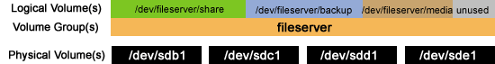
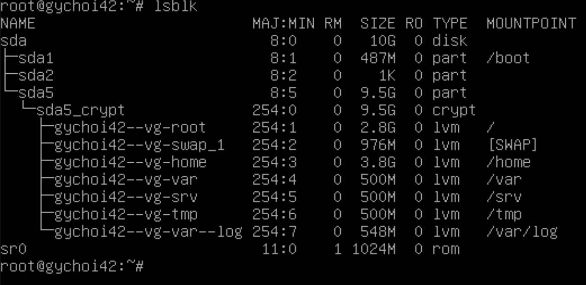

# Bonus Part

## LVM 파티션 추가하기

(갑작스러울 수 있지만, 물리적 볼륨, 볼륨 그룹, 논리적 볼륨을 한 번에 설명하는 그림)


이미지 출처: https://askubuntu.com/questions/417642/logical-volume-physical-volume-and-volume-groups

LVM 파티션을 추가하기 위해, 우선 가상 머신의 하드 디스크 용량을 늘려주기로 하였다. 커맨드 라인으로 입력하는 방법도 있으나... 간단하게 VM 매니저 어플리케이션으로 들어가, `File -> Virtual Media Manager -> Properties` 하단의 용량을 늘려주고(나는 8G에서 10G로 늘렸다), 적용 버튼을 누르면, 가상 머신의 용량이 증가한다.

증가한 가상 머신의 용량을 확인하기 위해 `lsblk`를 입력하고, `sda`를 살펴보면 된다.
- `lsblk` : 리눅스 디바이스 정보를 트리 형식으로 출력하는 명령어.
- `sda` : 리눅스 시스템이 첫 번째로 발견한 하드디스크의 이름. 가상 머신이 SCSI 인터페이스를 사용하여 `/dev/sda`로 불리는 듯하다.
- 참고: [https://m.blog.naver.com/tlsrka649/221797149037](https://m.blog.naver.com/tlsrka649/221797149037)

하드디스크에 (나의 경우에는) 2GB가 추가로 생겼으니, 이를 이용하여 파티션을 생성하자.

서브젝트에는 sda5 파티션의 크기를 늘려, 그 안에 추가로 여러 파티션을 쪼개어 넣었다. 따라서 먼저 sda5 파티션의 크기를 늘려야 한다.

그런데 기존 명령어인 `fdisk`를 사용하는 일은 너무 위험했다. `fdisk`로 크기를 늘리기 위해선 기존 sda5 파티션을 삭제하고 늘어난 전체 용량을 다시 배정하는 방식인데, sda5 파티션이 루트로써 동작하고 있기에, 섣부르게 삭제하다간 시스템이 망가져버린다(가상머신 파일 복사본을 따로 마련해서 다행이지 한 6번은 깨뜨려먹은 것 같다).

따라서 [GNU parted 유틸리티](https://geekpeach.net/ko/linux-parted-%EC%9C%A0%ED%8B%B8%EB%A6%AC%ED%8B%B0-%EC%9D%B4%ED%95%B4)를 사용하여, sda5 파티션의 크기를 늘렸다.

```sh
# 실행
parted /dev/sda

# 

apt install parted

resizepart 2, 5 to 100%

pvresize /dev/mapper/sda5_crypt
lvcreate -n var -L 500M gychoi42-vg
...
lvcreate -n var-log -l +100%FREE gychoi42-vg

mount 하기 전에, /var 의 내용을 따로 옮겨놓고, 다시 붙여넣어야 한다.
https://unix.stackexchange.com/questions/591971/after-partitioning-mounting-and-turning-of-directory-is-missing

mkfs.ext4 /dev/gychoi42-vg/var
...

mount /dev/gychoi42-vg/var /var
...
cd /var
mkdir log
mount /dev/gychoi42-vg/var-log /var/log

마지막에는 /etc/fstab에 위 UUID 적어야 부팅시 안지워짐

(나중에 좀 더 자세히 정리하기)
```



참고:  
[https://happylulurara.tistory.com/137](https://happylulurara.tistory.com/137)  
[https://lifegoesonme.tistory.com/449](https://lifegoesonme.tistory.com/449)  
[https://askubuntu.com/questions/1110790/encrypted-drive-cloning-resizing-partitions-problem](https://askubuntu.com/questions/1110790/encrypted-drive-cloning-resizing-partitions-problem)  
[https://unix.stackexchange.com/questions/637893/how-to-increase-lvm-when-using-luks2-on-debian-buster](https://unix.stackexchange.com/questions/637893/how-to-increase-lvm-when-using-luks2-on-debian-buster)  
[https://itguava.tistory.com/100](https://itguava.tistory.com/100)  
[https://starrykss.tistory.com/1760](https://starrykss.tistory.com/1760)
