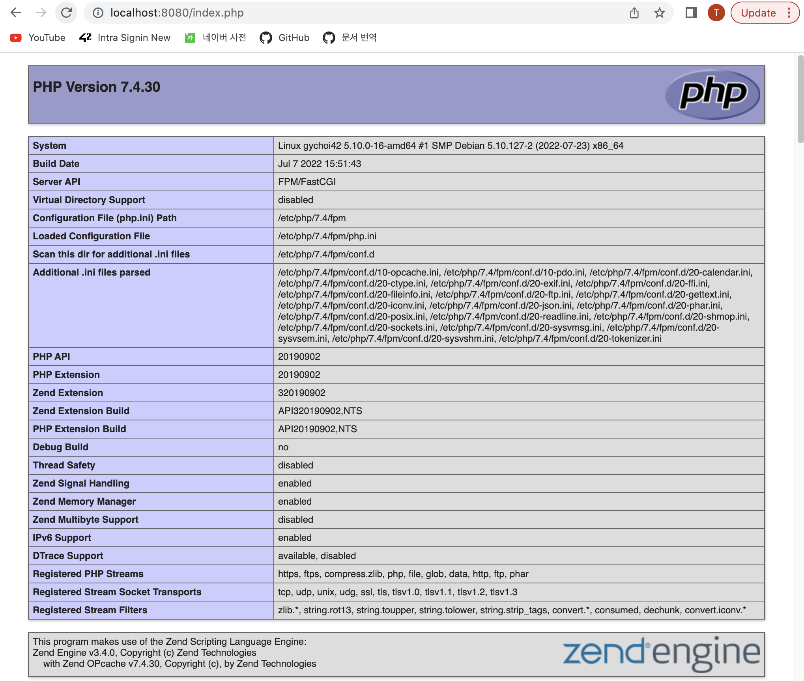
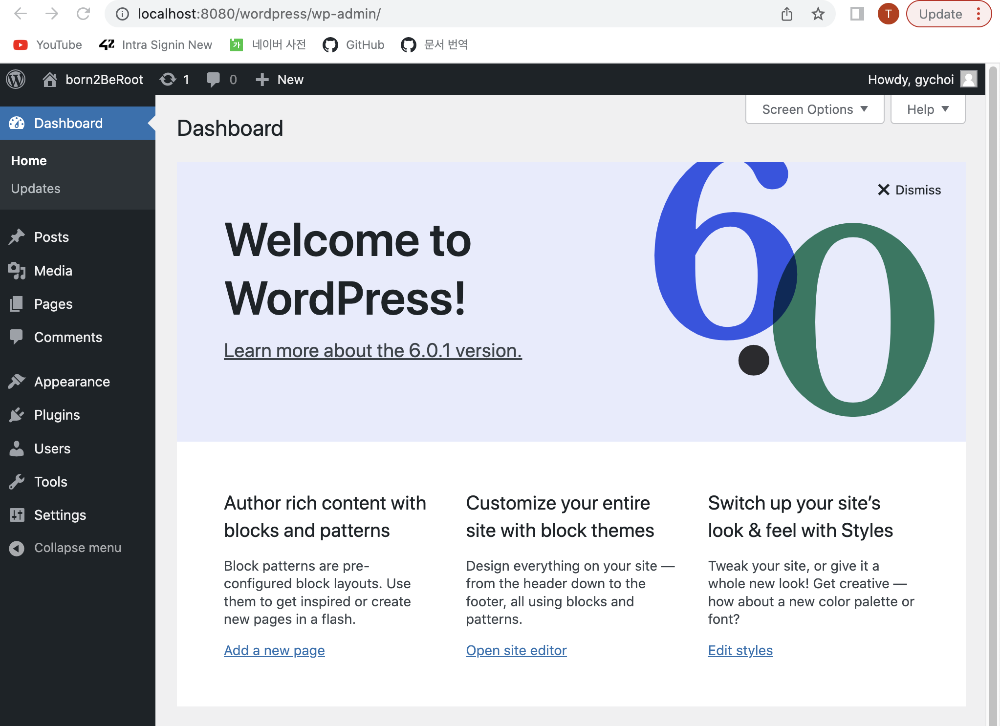

# Bonus Part

## LVM 파티션 추가하기

(갑작스러울 수 있지만, 물리적 볼륨, 볼륨 그룹, 논리적 볼륨을 한 번에 설명하는 그림)


이미지 출처: https://askubuntu.com/questions/417642/logical-volume-physical-volume-and-volume-groups

LVM 파티션을 추가하기 위해, 우선 가상 머신의 하드 디스크 용량을 늘려주기로 하였다. 커맨드 라인으로 입력하는 방법도 있으나... 간단하게 VM 매니저 어플리케이션으로 들어가, `File -> Virtual Media Manager -> Properties` 하단의 용량을 늘려주고(나는 8G에서 10G로 늘렸다), 적용 버튼을 누르면, 가상 머신의 용량이 증가한다.

증가한 가상 머신의 용량을 확인하기 위해 `lsblk`를 입력하고, `sda`를 살펴보면 된다.

- `lsblk` : 리눅스 디바이스 정보를 트리 형식으로 출력하는 명령어.
- `sda` : 리눅스 시스템이 첫 번째로 발견한 하드디스크의 이름. 가상 머신이 SCSI 인터페이스를 사용하여 `/dev/sda`로 불리는 듯하다.
- 참고: [https://m.blog.naver.com/tlsrka649/221797149037](https://m.blog.naver.com/tlsrka649/221797149037)

하드디스크에 (나의 경우에는) 2GB가 추가로 생겼으니, 이를 이용하여 파티션을 생성하자.

서브젝트에는 sda5 파티션의 크기를 늘려, 그 안에 추가로 여러 파티션을 쪼개어 넣었다. 따라서 먼저 sda5 파티션의 크기를 늘려야 한다.

그런데 기존 명령어인 `fdisk`를 사용하는 일은 너무 위험했다. `fdisk`로 크기를 늘리기 위해선 기존 sda5 파티션을 삭제하고 늘어난 전체 용량을 다시 배정하는 방식인데, sda5 파티션이 루트로써 동작하고 있기에, 섣부르게 삭제하다간 시스템이 망가져버린다(가상머신 파일 복사본을 따로 마련해서 다행이지 한 6번은 깨뜨려먹은 것 같다).

따라서 [GNU parted 유틸리티](https://geekpeach.net/ko/linux-parted-%EC%9C%A0%ED%8B%B8%EB%A6%AC%ED%8B%B0-%EC%9D%B4%ED%95%B4)를 사용하여, sda5 파티션의 크기를 늘렸다.

```sh
# parted 설치
apt install parted

# 실행
# (따로 디스크를 추가하지 않고 용량을 늘렸기에 첫 번째 하드디스크를 다룬다)
parted /dev/sda

# 2번 파티션, 5번 파티션을 늘어난 용량만큼 크기 조정.
# 2번 파티션은 논리적 파티션인 5번 파티션을 지시하고 있다.
# 따라서 2번과 5번을 모두 용량을 같게 처리해야 하나... 확신이 들지는 않지만,
# fdisk로 파티션의 끝을 확인해보면 동일하기에, 두 파티션 모두 용량을 최대로 늘리도록 명령어를 사용하였음.
(parted) resizepart 2
# 100% 입력하고 엔터
End?    [8.7GB]? 100%
...
# 파티션 5번에 대해 위와 동일하게 진행한다.
(parted) resizepart 5
End?    [8.7GB]? 100%

# 조정이 끝났다면, quit를 입력하고 프로그램을 나온다.
# 아마 reboot를 한 번 하고, 아래 pvresize를 실행해야 하는 것 같다.

# 먼저, pvs를 입력하여 우리가 늘리고자 하는 물리 디스크(물리 볼륨)의 이름을 확인하고(sda5_crypt),
# 아래의 명령어를 입력하여 할당된 디스크 공간에 맞게 파티션을 리사이징을 진행한다.
pvresize /dev/mapper/sda5_crypt

# 이제 다시 pvs를 입력하면, 반영 여부를 확인할 수 있다.

# root, home과 동일한 볼륨 그룹에 논리적 볼륨을 추가로 생성한다.
# 2GB만 추가해서 대충 4개를 비슷하네 분배했다. 어차피 구조만 비슷하면 될 것 같기에...
# -L은 MB, GB ... 단위로 정하는 명령이고, -l은 4MB 사이즈 기준으로 정하는 옵션이다.
lvcreate -n var -L 500M gychoi42-vg
lvcreate -n srv -L 500M gychoi42-vg
lvcreate -n tmp -L 500M gychoi42-vg
lvcreate -n var-log -l +100%FREE gychoi42-vg

# root와 home의 파일 시스템과 동일하게 파티션을 설정해주었다.
mkfs.ext4 /dev/gychoi42-vg/var
...
mkfs.ext4 /dev/gychoi42-vg/var-log

# 그리고 잠깐! 마운트(mount) 하기 전에, 개인적인 추측으로는
# /var 의 내용을 따로 옮겨놓고, 다시 var에 붙여넣어야 할 것 같다.
# 무턱대고 마운트 했다가 그 안의 파일이 모두 사라지는 참사가 발생했었음...

# 해당 링크를 따라 디렉토리를 마운트했다.
# https://unix.stackexchange.com/questions/131311/moving-var-home-to-separate-partition

# single user mode로 들어가, 디렉토리에 read-write 행동이 발생하지 않도록 한다.
init 1

# mnt 폴더에 임시로 디렉토리름 만들고, 마운트를 한다.
# 그런데 해당 과정이 왜 필요한지는 아직 정확히 모르겠음...
mkdir /mnt/var
mount /dev/gychoi42-vg/var /mnt/var

# 디렉토리로 이동하여 파일에 담긴 모든 정보를 mnt/<dir> 폴더에 복사한다.
cd /var
cp -ax . /mnt/var

# 디렉토리 복사본을 만들고 기존 디렉토리를 지운다.
cd /
mv var var.old

# 디렉토리를 새로 만든다.
mkdir var

# 마운트 해제
umount /dev/gychoi42-vg/var

# 새로 만들어진 디렉토리로 마운트
mount /dev/gychoi42-vg/var /var

# /etc/fstab 파일에 파티션의 정보를 저장해서 reboot 하더라도 지워지지 않게 한다.
# blkid 명령어로 파티션의 UUID를 맨 앞에 입력해도 된다.
/dev/gychoi42-vg/var    /var    ext4    defaults    0 0
# [파일시스템 장치명]   [마운트 포인트] [파일 시스템 종류]  [옵션]  [덤프, 파일체크 옵션]
# https://itdexter.tistory.com/311

# srv, tmp, var/log에 대해서도 위 과정을 동일하게 반복함.

# 모두 마운트가 완료되었다면, RunLevel을 변경하여 CLI 멀티태스킹 모드로 돌아온다.
init 3

# 여담이지만 systemctl get-default가 graphical.target로 나오기에
# systemctl set-default multi-user.target으로 변경하였다.
# https://shuzy65536.tistory.com/20
```

- `ext4` : `ext`는 리눅스용 파일 시스템을 의미한다. `ext4`는 이전의 버전들과 하휘 호환성을 가짐과 동시에 성능이 향상된 버전이라고 한다.
- 파일 시스템 : 운영체제가 파일을 사용자가 쉽게 접근 및 발견할 수 있도록, 시스템의 디스크상에 일정한 규칙을 가지고 보관하는 방식. 운영체제가 파일들을 일정한 규칙을 연속적으로 사용하여 디스크의 파티션 상에 저장하게 되면, 저장장치 내에서 파일을 저장하는데 용이하고, 파일 검색 및 관리를 효율적으로 할 수 있다. (http://www.incodom.kr/Linux/파일시스템)[http://www.incodom.kr/Linux/%ED%8C%8C%EC%9D%BC%EC%8B%9C%EC%8A%A4%ED%85%9C]
- 런 레벨(runlevel) : 시스템 관리의 용이함을 위하여 서비스의 실행을 단계별로 구분하여 적용하는 것. 1은 안전모드, 3은 텍스트 인터페이스 기반 다중 사용자 모드이고, 5는 그래픽 인터페이스 기반 다중 사용자 모드이다.
- fstab : 리눅스 부팅 시 마운트 정보와 파일 시스템 정보를 저장하고 있는 파일. 시스템이 부팅할 때 파일에 구성된 정보들이 자동으로 적용될 수 있도록 한다.


참고:  
[https://happylulurara.tistory.com/137](https://happylulurara.tistory.com/137)  
[https://lifegoesonme.tistory.com/449](https://lifegoesonme.tistory.com/449)  
[https://askubuntu.com/questions/1110790/encrypted-drive-cloning-resizing-partitions-problem](https://askubuntu.com/questions/1110790/encrypted-drive-cloning-resizing-partitions-problem)  
[https://unix.stackexchange.com/questions/637893/how-to-increase-lvm-when-using-luks2-on-debian-buster](https://unix.stackexchange.com/questions/637893/how-to-increase-lvm-when-using-luks2-on-debian-buster)  
[https://itguava.tistory.com/100](https://itguava.tistory.com/100)  
[https://starrykss.tistory.com/1760](https://starrykss.tistory.com/1760)  
[https://unix.stackexchange.com/questions/131311/moving-var-home-to-separate-partition](https://unix.stackexchange.com/questions/131311/moving-var-home-to-separate-partition)

## WordPress 구축

lighttpd, MariaDB, PHP를 이용하여 워드프레스 웹사이트를 구축해야 한다.

- lighttpd : Apache보다 적은 메모리 자원을 사용하면서도 높은 성능을 보이는 오픈소스 웹 서버 어플리케이션.
  - 웹 서버 : 웹 브라우저와 같은 클라이언트로부터 HTTP 요청을 받아들이고, HTML 문서와 같은 웹 페이지를 반환하는 컴퓨터 프로그램.
  - 참고 : [https://ko.wikipedia.org/wiki/웹서버](https://ko.wikipedia.org/wiki/%EC%9B%B9_%EC%84%9C%EB%B2%84), [https://aroundck.tistory.com/1113](https://aroundck.tistory.com/1113)
- MariaDB : MySQL을 유료화한 오라클에 대한 반발로 나온 오픈소스 RDBMS.
  - RDBMS(Relational Database Management System) : 관계형 데이터베이스(RDB, Relational Database)를 생성, 수정 및 관리할 수 있는 소프트웨어.
  - 참고 : [https://jwprogramming.tistory.com/52](https://jwprogramming.tistory.com/52), [https://bio-info.tistory.com/102](https://bio-info.tistory.com/102)
- PHP : 서버 측에서 실행되는 서버 사이드 스크립트 언어. PHP로 작성된 코드를 HTML 코드 안에 추가하면, 웹 서버는 해당 PHP 코드를 해석하여 동적 웹 페이지를 생성한다.
  - 자바스크립트는 클라이언트 측에서 실행되는 스크립트 언어.
  - 참고 : [https://choseongho93.tistory.com/61](https://choseongho93.tistory.com/61)
- 워드프레스 : 세계 최대의 온라인 발행 플랫폼으로, 웹페이지 제작 및 관리를 위한 콘텐치 관리 시스템(CMS, Contents Management System)의 하나.
  - 참고 : [http://b-lot.co.kr/워드프레스란/](http://b-lot.co.kr/%EC%9B%8C%EB%93%9C%ED%94%84%EB%A0%88%EC%8A%A4%EB%9E%80/)

우선 lighttpd 웹 서버를 설치하자.

```sh
apt install lighttpd
```

그리고 PHP를 설치해야 하는데, 일반적인 설치로는 Apache2가 자동으로 설치되기 때문에, 서브젝트의 요구에 맞게 Apache2를 제외하고 설치하도록 아래처럼 입력하였다. 또한 lighttpd는 FastCGI의 서포트 없이는 사용할 수 없다고 한다!

```sh
apt install php-fpm php-cli

# 잘 설치되었는지 확인하기 위해선 service로 상태를 확인하자.
# PHP가 7.4버전이라고 가정.
systemctl status php7.4-fpm

# Active: active (running) 확인.
```

- php-fpm : PHP를 FastCGI 모드로 동작하게 해준다고 하는데... (CGI, Common Gateway Interface는 웹서버와 외부 프로그램을 연결하는 표준화된 프로토콜) 왜 Apache2가 빠져있는지는 모르겠다 ㅎㅎ;;
- 참고 : [https://askubuntu.com/questions/1160433/how-to-install-php-without-apache-webserver](https://askubuntu.com/questions/1160433/how-to-install-php-without-apache-webserver)

그리고 `etc/php/7.4/fpm/php.ini` 파일에서, 아래의 문장을 찾아 주석 해제한다. (그냥 파일의 맨 아래에 추가해도 된다.)

```sh
cgi.fix_pathinfo=1
```

CGI, FastCGI에는 PATH_INFO가 없어 PHP가 URL로 쿼리와 같은 요청을 전달받을 수 없는 것 같다. `cgi.fix_pathinfo`를 1로 하면 PHP가 전달받은 요청을 최대한 찾고자 하여 결과를 반환하는 듯하다. Nginx에서는 보안상의 이유로 0으로 설정하라고 하지만, 현재 버전의 PHP에는 보안의 문제가 없다는 것 같기도 하고...

- 참고 : [https://stackoverflow.com/questions/15493207/php-what-are-the-effects-of-cgi-fix-pathinfo-1-in-php-ini-on-a-webserver](https://stackoverflow.com/questions/15493207/php-what-are-the-effects-of-cgi-fix-pathinfo-1-in-php-ini-on-a-webserver)

그리고 `/etc/php/7.4/fpm/pool.d/www.conf` 파일을 아래와 같이 수정한다.

```sh
# 36번째 라인
;listen = run/php/php7.4-fpm.sock
listen = 127.0.0.1:9000
```

- `listen` : 웹에서 PHP에 대한 요청이 들어오면, 해당 포트로 전달하여 PHP가 처리를 하도록, listening IP 포트를 지정하였다. 기존 소켓 연결은 잘 안된다고...
- 참고 : [https://goodsaem.github.io/local/105-mac-ubuntu-setup.html#5-php-www-설정](https://goodsaem.github.io/local/105-mac-ubuntu-setup.html#_5-php-www-%E1%84%89%E1%85%A5%E1%86%AF%E1%84%8C%E1%85%A5%E1%86%BC)

수정하였다면 `systemctl restart php7.4-fpm`으로 설정을 적용한다.

그리고 `/etc/lighttpd/conf-available/15-fastcgi-php.conf` 파일을 아래와 같이 수정한다.
해당 파일은 FastCGI로 PHP를 실행할 수 있도록 한다.

```sh
fastcgi.server += (".php" =>
		((
			#"bin-path" => "/usr/bin/php-cgi",
			#"socket" => "/run/lighttpd/php.socket",
			"host" => "127.0.0.1",
			"port" => "9000",
```

설정을 마쳤다면 FastCGI를 작동시키자.

```sh
lighty-enable-mod fastcgi
lighty-enable-mod fastcgi-php
# lighttpd 재시작
systemctl restart lighttpd
```

`/etc/lighttpd/lighttpd.conf` 파일을 보면, `server.document-root`가 `/var/www/html`에, 그리고 `server.port`가 HTTP 전용인 80번인 것을 확인할 수 있다.
이전 맨데토리 서브젝트에서, 오직 4242번 포트만을 허용하도록 방화벽을 설정하였는데, 서버의 HTTP 전송을 허용하기 위해 80번 포트를 연다.

```sh
ufw allow 80
```

그리고 호스트 컴퓨터의 웹브라우저에서 가상 머신의 웹 서버로 접속하기 위해, 포트포워딩을 진행하자. 나는 호스트 컴퓨터의 8080 포트를 가상 머신의 80번 포트와 연결하였다.

가상 머신으로 다시 돌아와, `/var/www/html`에 기본적인 PHP 파일을 하나 만들어보자. `/var/www/html` 디렉토리에 `index.php` 파일을 아래와 같이 간단하게 설정하였다.

```html
<?php
	phpinfo()
?>
```

이제 `localhost:8080/index.php`를 입력해보면...



웹 서버가 작동한다!

lighttpd와 PHP 설정을 모두 마쳤으니, MariaDB를 설치하자.

```sh
apt install mariadb-server mariadb-client

# systemctl로 MariaDB 상태 확인
systemctl status mariadb
# Active: active (running) 확인.
```

워드프레스와 PHP를 연결하기 위해 PHP용 MySQL도 다운로드하자. (다운로드 안하면 사이트가 작동하지 않는다.)

```sh
apt install php7.4-mysql
```

터미널에 `mariadb`을 입력하고 워드프레스용 데이터베이스를 만든다.

```sh
mariadb

# DB 생성
MariaDB [(none)]> CREATE DATABASE wordpress;
# root 계정 생성
MariaDB [(none)]> CREATE USER 'root'@'localhost' IDENTIFIED BY '<패스워드>';
# DB에 root 계정 접속 허용
MariaDB [(none)]> GRANT ALL ON wordpress.* TO 'root'@'localhost' IDENTIFIED BY '<패스워드>';
# 설정 적용
MariaDB [(none)]> FLUSH PREVILEGES;
# 나가기
MariaDB [(none)]> EXIT;

# 앞으로 MariaDB에 로그인하려면...
mariadb -u root -p
```

그리고 만약 몬가가 잘못되었다면... 이 [링크](https://m.blog.naver.com/PostView.naver?isHttpsRedirect=true&blogId=abc2185&logNo=220294755812)를 참고하면 도움이 될지도...?!

이제 마지막으로 워드프레스를 설치하자. 웹 서버의 루트 폴더인 `/var/www/html`에 `wget`로 워드프레스를 설치한다.

```sh
cd /var/www/html
wget https://wordpress.org/latest.tar.gz
```

- `wget` : HTTP 통신 또는 FTP 통신을 사용해 웹 서버에서 파일 또는 콘텐츠를 다운로드할 때 사용하는 소프트웨어.
- 참고 : [https://jokerkwu.tistory.com/43](https://jokerkwu.tistory.com/43)

다운로드를 마쳤다면, `tar`를 사용하여 파일을 푼다.

```sh
tar -xvzf latest.tar.gz
```

- `tar` : "테이프 아카이버(Tape ARchiver)"의 앞 글자들을 조합한 이름을 가진 명령어로, 여러 개의 팡리을 하나의 파일로 묶거나 풀 때 사용한다. 데이터의 크기를 줄이기 위한 파일 압축은 수행하지 않는다.
- `-x` : 아카이브에서 파일 추출(파일을 풀 때 사용).
- `-v` : 처리되는 과정을 자세하게 나열.
- `-z` : gzip 압축 적용 옵션.
- `-f` : 대상 아카이브 지정 (기본 옵션).
- 참고 : [https://recipes4dev.tistory.com/146](https://recipes4dev.tistory.com/146)

`/var/www/html/wordpress`로 이동하여, `wp-config-sample.php` 파일을 수정한다.

```sh
# 22번째 줄부터
/** The name of the database for WordPress */
define( 'DB_NAME', 'wordpress' );

/** MySQL database username */
define( 'DB_USER', 'root' );

/** MySQL database password */
define( 'DB_PASSWORD', '<패스워드>' );

/** MySQL hostname */
define( 'DB_HOST', 'localhost' );

/** Database Charset to use in creating database tables. */
define( 'DB_CHARSET', 'utf8' );
```

사이트의 보안을 위해서 파일 하단의 "Authentication Unique Keys and Salts"에 랜덤한 UUID를 입력해도 된다.
해당 값들은 웹 브라우저의 쿠키와 세션에 저장되어 암호화에 사용된다고 한다.
다만 나는 워드프레스를 띄우는 일만 진행하고자 한다. (어차피 가상머신 끄면 접속하지 않을 것이기도 하고...)

- 참고 : [https://swiftcoding.org/changing-wp-salt-keys](https://swiftcoding.org/changing-wp-salt-keys)

설정을 모두 완료했다면 `wp-config-sample.php` 파일을 `wp-config.php` 파일로 변경한다.

```sh
mv wp-config-sample.php wp-config.php
```

웹 브라우저에 `localhost:8080/wordpress`를 입력하고 들어가 계정을 생성하고 로그인을 하면...



짠! 아주 깔끔하고 멋진 워드프레스 홈페이지가 나온다. 새까만 터미널 화면만 보다가 웹페이지를 보니 눈이 정화되는 기분이다.

참고 :  
[https://www.atlantic.net/dedicated-server-hosting/how-to-install-wordpress-with-lighttpd-web-server-on-ubuntu-20-04/](https://www.atlantic.net/dedicated-server-hosting/how-to-install-wordpress-with-lighttpd-web-server-on-ubuntu-20-04/)  
[https://nostressdev.tistory.com/11](https://nostressdev.tistory.com/11)

pool이란? php.ini란?

## 유용한 서비스 설치하기

NGINX와 Apache2를 제외한 유용한 외부 서비스를 설치한다. 예전부터 터미널로 파일을 전송하는 FTP(File Transfer Protocol)에 매력을 느끼고 있었기에 이번 기회에 FTP를 설치하고 운용하는 방법을 배워보려 한다.

- FTP : 원격 네트워크와의 파일 전송에 사용되는 표준 네트워크 프로토콜.

먼저 가상 머신에 vsftpd(Very Secure FTP Daemon)을 설치하자.

```sh
# 먼저 vsftpd가 데비안 저장소에 있는지 검사를 하고...
apt search vsftpd

# ... 패키지가 존재한다면 설치를 한다.
apt install vsftpd

# vsftpd 서비스 상태 확인
systemctl status vsftpd
# Active: active (running) 확인.
```

`lsof` 명령어로 현재 vsftpd가 기본적으로 21번 포트를 열고 있는지 확인하자.

```sh
lsof -PiTCP

# Output:
vsftpd    937    root   3u    IPv6    0t0    TCP  *:21 (LISTEN)
```

- `-P` : `/etc/services`에 등록되어 있는 이름 대신 포트 넘버로 출력한다.
- `-i` : 설정한 네트워크 소켓에 대한 정보와 프로토콜, 서비스, 호스트 및 IP에 대해 출력한다.
- `-TCP` : `-i`로 불러운 정보 중 TCP만을 출력
- 참고 : [https://blog.cafe24.com/1989](https://blog.cafe24.com/1989)

vsftpd에 대한 설정은 `/etc/vsftpd.conf`에서 진행된다. 몇 가지 중요한 설정에 대해 확인하자.

로컬 계정 사용자의 접속과 파일 시스템 변경을 허용하자.

```sh
# 28번째 줄
local_enable=YES

# 31번째 줄
write_enable=YES
```

특정 사용자만 FTP 서버에 로그인할 수 있도록 설정하자.

```sh
# 파일 하단에 추가
userlist_enable=YES
userlist_file=/etc/vsftpd.user_list
userlist_deny=NO
```

FTP 서버의 수동(Passive) 모드를 허용하도록 하자.

```sh
pasv_enable=YES
pasv_min_port=8484
pasv_max_port=8484
pasv_address=127.0.0.1
```

FTP에는 Active 모드와 Passive 모드가 있다.

- Active 모드는 서버가 클라이언트에 접속을 하는 과정이라고 말할 수 있다. 만약 FTP 클라이언트의 방화벽에 의해 외부에서 접속이 되지 않는다면, FTP 접속이 불가능하게 된다. 만일 접속이 되더라도 데이터 목록을 불러오지 못한다.
- Passive 모드는 Active 모드의 단점을 보완한 것으로, 클라이언트가 FTP 서버의 다른 포트(1024~65536)로 접속하여, FTP 통신을 진행한다.
- 참고 : [https://madplay.github.io/post/ftp-active-passive](https://madplay.github.io/post/ftp-active-passive)

그 외 설정들...

```sh
# 한국인이라면 utf-8 씁시다
# 물론 가상 머신에서 한국어를 지원 안하면 어차피 안보임 ㅋ
utf8_filesystem=YES

# FTP 접속 시 배너 설정
ftpd_banner= WELCOME!
```

설정이 모두 완료되었다면 서비스를 다시 시작한다.

```sh
systemctl restart vsftpd
```

마지막으로 FTP 전송을 하기 위해, 방화벽을 열어주어야 한다.
포트 21은 FTP 명령 포트로 작동하고, 포트 20은 FTP 데이터 포트로 작동한다고 하는데,
21번 포트만 열어도 파일 전송이 되는 것 같다.

```sh
# Active 모드 FTP 포트 개방
ufw allow 21

# Passive 모드 FTP 개방
ufw allow 8484
```

UFW도 한번 리로드해주자.

```sh
ufw reload
```

이제 포트포워딩을 하자. 호스트 머신의 2121번 포트를 가상 머신의 21번 포트와 연결하였다. 그리고 호스트 머신의 8484번 포트를 가상 머신의 8484번 포트와 연결하였다. 두 포트를 모두 연결하여야 FTP가 정상적으로 진행이 된다!

[파일질라](https://filezilla-project.org/)로 즐거운 FTP 파일 전송을 해보자.

- 만약 553 오류가 난다면, [이 링크](https://thinkerodeng.tistory.com/240)를 참고.
- Passive 모드에서 주소가 `(0,0,0,0)`으로 찍힌다면, [이 링크](https://superuser.com/questions/1502015/227-entering-passive-mode-0-0-0-0-when-connecting-to-vsftpd-ftp-server)를 참고.

참고 : [https://jjeongil.tistory.com/1448](https://jjeongil.tistory.com/1448)

---

보너스 파트를 하고 나니, 파티션도 그렇고 UFW 방화벽도 그렇고 조금 지저분해진 것 같다.
잘 방어해서 한 번에 통과할 수 있으면 좋겠다!
꿈에 그리던 FTP를 실제로 사용해보다니 정말 즐겁다.
(다만 SSL, chroot와 같은 FTP 보안 향상은 모종의 이유로 잘 안되었지만... 그래도 이 정도가 어디야!)
