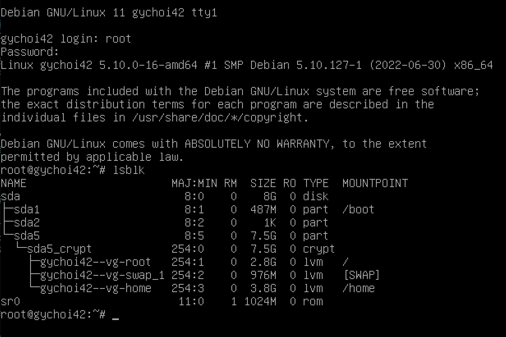
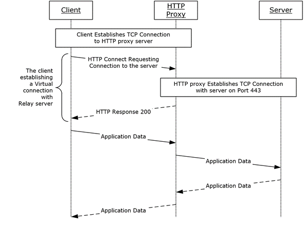
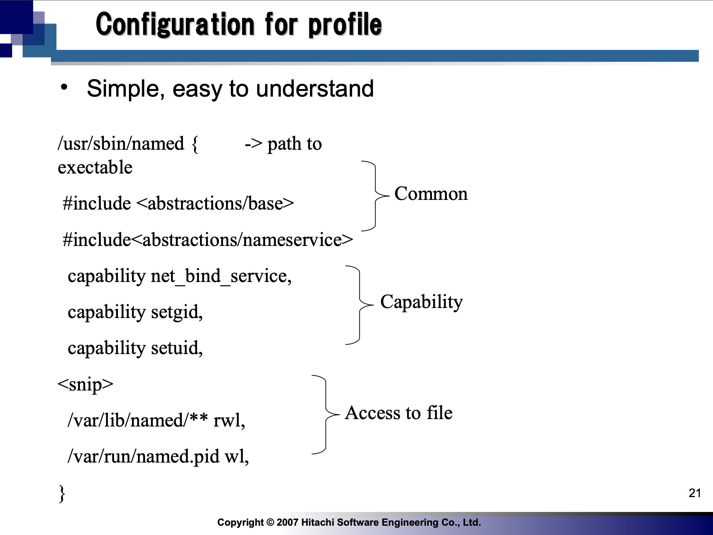

# 목차 

1. [가상머신이란?](#vm)
2. [CentOS? Devian?](#centosdevian)
3. [Devian 설치하기](#installdevian)
4. [LVM](#lvm)
5. [http 프록시](#httpproxy)
6. [GRUB](#grub)
7. [apptitude vs. apt](#apptitudeapt)
8. [SELinux, AppArmor](#selinuxapparmor)

# 가상 머신(Virtual Machine, VM)이란? 

가상화란 일반적으로 컴퓨터 리소스를 추상화함을, 즉 컴퓨터 내부의 작동 방식을 다른 시스템, 응용 프로그램, 사용자들로부터 감추는 기술을 의미한다. 그렇다면 가상 머신(가상화된 컴퓨터?!)이란 무엇일까?

가상 머신은 **물리적 컴퓨터와 동일한 기능을 제공하는 소프트웨어 컴퓨터**이다. 가상 머신은 (지금 우리가 다루고 있는) 물리적 컴퓨터와 동일하게 애플리케이션과 운영 체제를 실행하지만, 가상 머신은 물리적 컴퓨터 안에서 실행되고 작동하는 컴퓨터 파일일 뿐이다. 컴퓨터 안의 컴퓨터라니!

가상 머신을 사용하면 위험한 작업을 자유롭게 테스트할 수 있다. 가상 머신은 호스트 컴퓨터로부터 샌드박스화 되므로, 변조된 파일이 호스트 컴퓨터를 위협할 수 없다. 혹은 호스트 컴퓨터의 운영 체제에 제한되지 않고 다양한 운영 체제 환경을 실행할 수 있을 것이다. 하지만 한 대의 컴퓨터에서 또 다른 컴퓨터를 실행하는 일은 아주 무겁기에(하나의 물리적인 자원을 두 대의 컴퓨터가 동시에 사용한다면...), 여러 가상 머신을 실행할 경우, 호스트 컴퓨터의 성능이 불안정해질 수 있다. 또한 가상 머신은 물리적 컴퓨터보다 효율성이 떨어지고 속도도 느린 경향이 있다.

참고: [https://www.vmware.com/kr/topics/glossary/content/virtual-machine.html](https://www.vmware.com/kr/topics/glossary/content/virtual-machine.html)

혹시 게임을 좋아하는 사람이라면 '에뮬레이터'가 떠오르지 않았을까? 그렇다면 에뮬레이터와 가상 머신은 어떤 차이가 있을까?

가상화 방법에는 다음의 3가지가 있다고 한다: 호스트 가상화, 하이퍼바이저 가상화, 컨테이너 가상화

* 호스트 가상화 : 게스트 운영 체제(게스트 OS, 가상의 컴퓨터)를 호스트 운영 체제(호스트 OS, 물리적 컴퓨터)의 소프트웨어로 에뮬레이팅하는 방식으로, 오버헤드가 크지만 범용성은 가장 뛰어나다.
* 하이퍼바이저 가상화 : 물리적 컴퓨터의 하드웨어에 '하이퍼바이저'라는 소프트웨어를 설치하여, 호스트 운영 체제의 개입 없이 게스트 운영 체제와 물리적 하드웨어와의 직접적인 상호작용을 가능하게 하는 방식(bare-metal).
* 컨테이너형 가상화 : 위의 두 방식과는 다르게 운영 체제가 아닌 소프트웨어를 바로 가상화하는 기술. 호스트 운영 체제 위에 컨테이너가 '이미지'라는 (가벼운) 실행 패키지를 빌드, 배포, 작동한다.

정리하면, 호스트 가상화는 실제 물리적 컴퓨터의 리소스를 가상 머신과 공유하고, 하이퍼바이저 가상화는 (호스트 가상화와는 다르게) 게스트 운영 체제가 호스트 운영 체제를 경유하지 않기에 오버헤드가 적어 퍼포먼스가 좋다. 컨테이너형 가상화는 OS 자체를 가상화하지 않기에, 가상화 소프트웨어를 가벼운 리소스와 함꼐 빠르게 사용할 수 있다. 이번에 사용하는 Virtual Box는 호스트 가상화인 듯 하다.

참고: [https://eunjinii.tistory.com/10](https://eunjinii.tistory.com/10)

[목차로](#table)

# CentOS? Debian? 

리눅스(linux)는 오픈소스로써 누구나 자유롭게 수정하고 배포할 수 있다. 따라서 수많은 형태의 리눅스들이 나오게 되었는데, 크게 두 가지 계열의 리눅스로 말할 수 있다고 한다. 바로 레드햇 계열과 데비안 계열이다. 이들의 대표적인 버전으로 레드햇은 센토스(CentOS), 데비안은 우분투(UbuntuOS)가 있다. (하지만 과제에서 사용해야 하는 버전은 센토스와 데비안 자체이다!)

참고: [https://jhnyang.tistory.com/135](https://jhnyang.tistory.com/135)

## CentOS

레드햇 엔터프라이즈 리눅스(RHEL)이 유료화됨에 대한 반발로 나온 운영체제. RHEL의 기술을 그대로 사용할 수 있다는 장점이 있지만, 오픈소스로 돌아가기에 사후 기술 지원이 RHEL에 비해 느리다고 한다. `yum`(Yellodog Update Modified)이라는 패키지 설치 관리 도구(패키지 매니저)를 사용한다.

참고: [https://dololak.tistory.com/331](https://dololak.tistory.com/331)

## Devian

데비안은 순수하게 오픈소스 자원자들로부터 구성된 운영체제이다. 데비안은 안정성을 매우 중시하는 리눅스 배포판이여서, 서버 사용에 있어 상당한 인기를 끌고 있다고 한다. `apt`(Advanced Packaging Tool)라는 패키지 매니저를 사용한다(`apt-get`과 큰 차이는 없다) 유명한 오픈소스인 만큼 커뮤니티도 아주 크다.

참고: [https://la-nube.tistory.com/190](https://la-nube.tistory.com/190)

이번 과제에서는 Devian을 사용할 예정이다('`Debian` is highly recommended if you are new to system administration.' ㅎㅎ;;) Devian 11은 여러 하드웨어의 지원과 더불어 Apache, Emacs, LibreOffice, Vim의 최신 버전과(Vim은 최근 9.0이 나왔지만...) 업데이트된 Linux kernal을 사용한다.

[What's New in Devian 11 "Bullseye"?](https://www.linuxjournal.com/content/whats-new-debian-11-bullseye)

[목차로](#table)

# Devian 설치하기 

설치 과정은 다음의 블로그들을 참고했다:  
[https://techdebt.tistory.com/18](https://techdebt.tistory.com/18)

[https://velog.io/@octo__/Born2beRoot-Virtualbox-Debian-설치](https://velog.io/@octo__/Born2beRoot-Virtualbox-Debian-%EC%84%A4%EC%B9%98)

먼저, [https://www.debian.org/releases/stable/debian-installer/](https://www.debian.org/releases/stable/debian-installer/)로 이동하여, 'netinst'(전체 운영 체제를 설치할 수 있는 단일 CD)에서 `amd64`의 디스크 이미지를 다운로드한다.
* AMD64 : AMD사가 만든 64bit 프로세서(x86-64). 기존 32bit 아키텍처와 호환되면서도 인텔의 프로세서와 다르게 성능 저하가 없어 64bit 프로세서의 표준으로 자리가 매겨졌다고 한다. (ARM64와 헷갈리지만... ARM은 RISC 명령어 체계를 사용하고, 인텔 계열의 AMD는 CISC 명령어 체계를 사용한다.)
* iso : 국제 표준화 기구(ISO)가 제정한 광학 디스크의 압축 파일 형식. 모든 CD나 DVD를 ISO 형식의 파일로 만들 수 있기에, 물리적인 매체를 이용하지 않아도 인터넷 연결을 통하여 디스크의 파일을 전송할 수 있다. ISO 파일은 일반적인 압축 툴로 읽거나 실행하기 어렵기에 특정한 도구를 사용해야 한다.

이제 Virtual Box를 키고 Linux Devian 가상 머신을 설치하자.

1. Virtual Box 상단의 'new'를 클릭하여 가상 머신 생성 과정으로 들어간다.
2. 가상 머신을 설치할 경로를 선택한다. 8GB의 용량이 필요하기에 goinfre에 저장하고 디스크 이미지(VDI)를 다시 압축해서 클라우드에 올려놓거나, 개인이 소지한 하드디스크에 저장해야 한다.
3. 메모리는 1024MB로 설정.
4. 그리고 '새 가상 하드디스크 만들기', 'VDI', '동적 할당', 8GB를 선택한다.
	- VDI(VirtualBox Disk Image) : Oracle의 Virtual Box에서만 사용 가능한 포맷 방식. Virtual Box에서만 사용할 것이기에 VDI를 선택함.
	- VHD(Virtual Hard Disk) : Virtual Box 외에도 Hyper-V, Xen에서 구동이 가능한 포맷 방식.
	- VMDK(Virtual Machine Disk) : Virtual Box와 VMware Player에서 구동이 가능한 포맷 방식.
	- 동적 할당(dynamically allocation)은 가상 머신이 사용한 만큼만 호스트 컴퓨터의 하드 디스크 용량을 사용한다. 고정 할당(Fixed size)을 사용하면 가상 머신을 좀 더 빠르게 사용할 수 있지만, 호스트 컴퓨터를 보다 쾌적하게 이용하기 위해 동적 할당을 선택하였다.
5. 선택을 모두 완료하고, Virtual Box 창으로 다시 나오게 되면, 상단의 'start'를 누르고 다운로드했던 iso 파일을 마운트한다.
6. 'install' -> 언어 설정 -> 타임존 설정 -> 키보드 언어 설정
7. 서브젝트에 나온 대로 hostname은 'intra id'42로 해야 한다(즉, gychoi42).
8. 도메인 이름은 생략.
9. 비밀번호 설정. 비밀번호를 설정하지 않으면 root, 유저 구분 없이 모두 sudo를 사용할 수 있게 되어버린다!
10. root가 아닌 유저 한 명을 추가한다. 유저 이름은 인트라 id 그대로 하였음.
11. 서브젝트의 요구에 따라 LVM을 사용한다. 'use entire disk and set up encrypted LVM' 선택.
12. 서브젝트의 요구에 따라 2개 이상의 encrypted partition을 만들기 위해 /home 파티션을 분리하는 옵션을 선택한다.
13. LVM에도 비밀번호를 설정해주자.
14. 서브젝트에 나온대로 파티셔닝을 하기 위해 최댓값(8.1GB)로 설정한다.
15. extra media installation은 생략.
16. 패키지를 다운로드하는데 사용할 네트워크 서버는 한국 - debian으로 선택(카이스트 미러 서버가 대학에서 운영하다 보니 생각보다 느리다고 해서...).
17. http proxy 설정은 생략.
18. 데스크탑 환경은 사용하지 않을 것이기에 기본 값만 설정한다.
19. GRUB 부트로더를 설치해야 11버전은 클러스터에서 돌아간다고 한다!
20. 그리고 /dev/sda에 부트로더를 설치해야 한다고 한다. 그렇지 않으면 부트로더가 하드 드라이버의 시스템들을 다루지 못하는 듯 하다. 부트로더는 /dev/sda에 있지만, 부트로더의 코드들은 /dev/sda1에 저장되므로, 서브젝트의 디렉토리 구조와 일치하게 된다(꼭 일치해야 하는지는 모르겠지만...)
	- [https://opencomputeproject.github.io/onie/design-spec/x86_boot_loader.html](https://opencomputeproject.github.io/onie/design-spec/x86_boot_loader.html)
21. LVM 비밀번호, root/root 비밀번호 입력 후 들어가면 가상 머신의 세계가 등장한다. `lsblk` 명령어를 입력하여 LVM 파티션이 두 개인지 확인하자.

- swap? : 디스크 공간을 메모리 공간처럼 교환하여 사용하는 것. /swap 파티션은 swap 파일 시스템을 위한 공간이다. 메모리 공간이 부족할 때 디스크 공간을 메모리처럼 사용할 수 있다.
- sda? : 소형 컴퓨터 인터페이스(Small Computer System Interface, SCSI) 방식의 하드디스크 중 하나. SCSI란 컴퓨터에 주변기기를 연결하기 위한 표준 인터페이스이다.
	- sda2 : `fdisk`를 입력하면, Extended라고 표시되는데, 이는 sda2가 sda5를 지시하는 포인터의 역할을 함을 의미한다. (그렇기에 용량이 작다.) ([https://unix.stackexchange.com/questions/83781/understanding-partition-table-with-sda1-sda2-sda5](https://unix.stackexchange.com/questions/83781/understanding-partition-table-with-sda1-sda2-sda5))
	- encrypted partitions : LVM에 의해 만들어진 암호화된 파티션. /boot 파티션은 일반적으로 암호화되지 않는다고 한다. ([https://unix.stackexchange.com/questions/657922/what-is-an-encrypted-lvm](https://unix.stackexchange.com/questions/657922/what-is-an-encrypted-lvm))

[목차로](#table)

# LVM 

LVM(Logical Volumn Manager)은 리눅스의 저장 공간을 효율적이고 유연하게 관리하기 위한 커널의 한 부분이다.

이전에는 하드 디스크를 파티셔닝 한 후 OS 영역에 마운트 하여 read/write를 수행하였는데, 이 경우 저장 공간의 크기가 고정되어 유연하게 대응하기가 어렵다. 이를 보완하기 위한 방법으로 LVM을 구성할 수 있다. LVM은 파티션 대신 volume이라는 단위로 저장 장치를 다룬다. LVM은 스토리지의 확장 및 변경에 유연하며, 크기를 변경할 때 기존 데이터의 이전이 필요 없다.
- 마운트(mount) : 물리적인 디스크를 운영체제에 고정(연결)하는 것. 즉 파티션의 자원을 사용자가 사용할 수 있도록 **디스크 공간과 디렉토리를 연결**한다. (USB를 컴퓨터에 연결하여 사용하는 과정을 떠올려보자.) 그런데 CLI 환경의 리눅스에서는 자동으로 마운트가 되지 않는다. 그리고 마운트는 외부 장치 뿐만 아니라 위 사진처럼 부팅용 디스크 공간을 /boot 파티션에 연결하는데도 사용된다. /boot 파티션에는 부팅 시스템 파일들이 설치된다.
- 파티션(partition) : 디스크 공간을 나눈 것. sda는 크게 sda1와 sda2 파티션으로 나누어진다. sda1은 Boot용 파티션으로 사용되고, sda2는 나머지 모든 리눅스 정보를 담는데 사용된다. 리눅스 서버에서 파티션을 나누는 이유는 관리의 편리함도 있지만, **시스템 안정성 확보와 보안**을 위해 꼭 필요한 부분이기도 하다. 파티션을 나누지 않고 사용할 경우, 용량이 꽉 찼을 때 새로운 프로세스를 실행할 수 없게 되거나, 프로세스가 중단되는 문제가 발생한다.
- 확장 파티션(extended partition) : 일반적으로 파티션은 최대 4개 까지 나누는 것이 가능하지만, extended 파티션 기술을 사용하면, extended 파티션으로 정해진 파티션 내에서 여러 개의 파티션을 나눌 수 있다. 그러한 파티션을 logical partition이라고 부른다. logical 파티션은 무조건 5번부터 시작한다.

그렇다면 LVM은 저장 공간을 어떻게 유연하게 관리할까? 간단하게 요약한다면, LVM은 여러 개의 디스크 공간을 합쳐 하나의 공간을 사용하는 것처럼 만든다. 리눅스 서버를 운영할 때, 일반적으로 컴퓨터를 사용하는 것처럼 디스크 용량이 부족하면 교체하는 일은 매우 힘들다. 물리 디스크를 추가하여 파티션의 크기를 변경하기 위해선 운영체제 재설치를 해야한다. 하지만 LVM을 사용하면 재설치 없이 크기를 조정할 수 있고, 사용하기 애매한 짜투리 공간까지 모두 하나의 공간으로 모아주기에 디스크 공간을 효율적으로 사용할 수 있다.

참고: [https://mamu2830.blogspot.com/2019/12/lvmpv-vg-lv-pe-lvm.html](https://mamu2830.blogspot.com/2019/12/lvmpv-vg-lv-pe-lvm.html)

[목차로](#table)

# http 프록시 

프록시(Proxy)란 대리 혹은 중계의 의미를 가지며, 프록시 서버는 클라이언트와 서버 사이에서 중간자 역할을 한다. 프록시 서버는 인터넷 연결을 위한 인증, 인터넷 연결 공유, 대역폭 제어 그리고 정보를 필터링하거나 블락킹을 할 수 있다. http 프록시 서버는 http 요청을 받는 프록시 서버다. 웹 서버처럼 http로 들어온 요청을 다루고 응답을 클라이언트에게 돌려면서 동시에 http 클라이언트처럼 요청을 서버로 보낸다.

이미지 출처: https://docs.microsoft.com/en-us/openspecs/office_protocols/ms-grvhenc/2c054f5b-804d-40c3-8695-f4298b5931b6

참고: [https://code-masterjung.tistory.com/53](https://code-masterjung.tistory.com/53)

[목차로](#table)

# GRUB 

GRUB(Grand Unified Bootloader)은 GNU에서 만든 부트로더로, 대부분의 리눅스가 GRUB을 기본 부트로더로 설정한다. 부트로더는 리눅스 OS의 커널 이미지를 로드하고, 이후 커널이 기본적인 작동을 완료하여 시스템 부팅이 완료된다. GRUB은 파일명과 커널이 위치하고 있는 디스크 파티션만 알고 있다면 커널을 로드할 수 있다. 몇몇 리눅스 커널은 GRUB과 같은 부트로더 없이도 부팅 작업을 할 수 있지만, 자료가 사라지는 등 여러 문제가 발생하기에 왠만해선 부트로더를 설치하는 것이 안전하다고 한다. ([https://tecporto.pt/wiki/index.php/Booting_the_Linux_Kernel_without_a_bootloader](https://tecporto.pt/wiki/index.php/Booting_the_Linux_Kernel_without_a_bootloader))
* 부트로더(Bootloader) : 운영 체제가 실행되기 이전에 미리 실행되어 커널이 올바르게 실행될 수 있도록 사전 작업을 수행하고 최종적으로는 아무 이상 없이 운영 체제를 실행시키기 위한 프로그램.

참고: [https://youngswooyoung.tistory.com/67](https://youngswooyoung.tistory.com/67)

[목차로](#table)

# aptitude vs. apt 

apt는 소프트웨어의 설치와 제거를 처리하는 패키지 관리 도구다. apt 명령어에 설치할 패키지 이름을 입력하면, `/etc/apt/sources.list`에 지정된 소스 목록에서 해당 패키지 + 종속성 목록을 함께 찾아 자동으로 설치한다. 따라서 패키지를 설치할 때 종속성 문제를 걱정하지 않아도 된다.

aptitude는 사용자 인터페이스를 추가해, 사용자가 텍스트 기반 대화형으로 패키지를 검색하고 설치, 제거할 수 있는 high-level 패키지 관리 도구이다. aptitude는 apt보다 더 방대하고 많은 일을 할 수 있다.
- 설치된 패키지 목록을 보여주고, 패키지를 자동 또는 수동으로 설치하도록 표시하며, 업그레이드에 사용할 수 없는 패키지를 보관할 수 있다.
- aptitude는 패키지를 삭제할 때 사용되지 않는 패키지까지 삭제하는 반면, apt는 `-auto-remove`, `apt-get autoremove`를 명시해줘야 한다.
- aptitude는 `why`, `why-not` 명령어로 동작이 잘 안되는 이유를 볼 수 있다.
- apt는 패키지 설치/제거 중 충돌이 일어나면 종료되지만, aptitude는 해결 방법을 제시한다.

참고: [https://velog.io/@joonpark/aptitude-vs-apt](https://velog.io/@joonpark/aptitude-vs-apt)

* apt 관련 정보가 인터넷에 더 많기도 하고, 아직은 인터페이스가 친절한 점이 딱히 매력으로 다가오지 않아 apt를 그대로 사용할 계획.

[목차로](#table)

# SELinux, AppArmor 

## SELinux

SELinux(Security Enhanced Linux)는 Linux 시스템용 보안 아키텍처(혹은 Linux Kernel 보안 모듈)로, 과거 리눅스는 소스코드가 공개되어 있었기에 보안이 취약한 측면이 있어, 리눅스의 시스템 액세스 권한을 강화하기 위해 만들어졌다고 한다. SELinux는 매우 강력한 프로그램으로, 파일 1개를 읽을 때 조차도 권한을 검사할 정도로 강력한 보안을 요구한다. IBM/RedHat 계열에서 선호되는 보안 프레임워크이다. (하지만 SELinux는 침입 차단 시스템이나 바이러스 백신처럼 작동하는 것이 아닌, 시스템 버그 및 오류로부터 2차 피해를 막는 것이기에, 여러 보안 요소와 함께 사용하여야 한다.)

참고:  
[https://it-serial.tistory.com/entry/Linux-SELinux-개념-관련-명령어](https://it-serial.tistory.com/entry/Linux-SELinux-%EA%B0%9C%EB%85%90-%EA%B4%80%EB%A0%A8-%EB%AA%85%EB%A0%B9%EC%96%B4)

[https://velog.io/@octo__/Born2beRoot](https://velog.io/@octo__/Born2beRoot)

## AppArmor

AppArmor도 SELinux와 동일하게 리눅스 보안 모듈이다. AppArmor와 SELinux 모두 MAC(Mandatory Access Control, 강제적 접근 통제) 보안을 제공한다. 차이점이라면 SELinux는 파일에 라벨을 적용하지만(inode-based), AppArmor는 파일 경로를 통해 작동한다(path-based). 또한 SELinux는 policy file과 right file system을 통해 작동하지만, AppArmor는 policy file만으로 작동한다. 그렇기에 SELinux가 조금 더 복잡하다고... 그리고 SELinux는 시스템 전체에 보안을 설정하지만, AppArmor는 응용프로그램 단위의 보안 모델을 구현하여, 개별 응용프로그램을 보호하는 일에 집중한다. Devian 계열에서 선호하는 보안 프레임워크이다.

* inode : 파일을 기술하는 디스크 상의 데이터 구조로서, 파일의 데이터 블록이 디스크 상의 어느 주소에 위치하고 있는가와 같은 파일에 대한 중요한 정보를 갖고 있다.
* 정책 파일(Policy File) : 유닉스와 리눅스 시스템에서 권한 관리(Privilege Management) 기반의 시스템 보안 규칙을 정의하는 명령어들을 모아놓은 파일.
* 접근 통제(Access Control) : 운영체제에서 접근 통제는 디렉터리나 파일, 네트워크 소켓과 같은 시스템 자원을 적절한 권한을 가진 사용자나 그룹이 접근하고 사용할 수 있게 통제하는 것을 의미한다.

이미지 출처: https://elinux.org/images/3/39/SecureOS_nakamura.pdf

참고: [https://velog.io/@kdkeiie8/Linux-AppArmor-리눅스-커널-보안-모듈](https://velog.io/@kdkeiie8/Linux-AppArmor-%EB%A6%AC%EB%88%85%EC%8A%A4-%EC%BB%A4%EB%84%90-%EB%B3%B4%EC%95%88-%EB%AA%A8%EB%93%88)

Devian 11에는 AppArmor가 이미 깔려 있기에, `aa-status` 명령어로 AppArmor가 실행 중인지 확인할 수 있다.

[목차로](#table)
