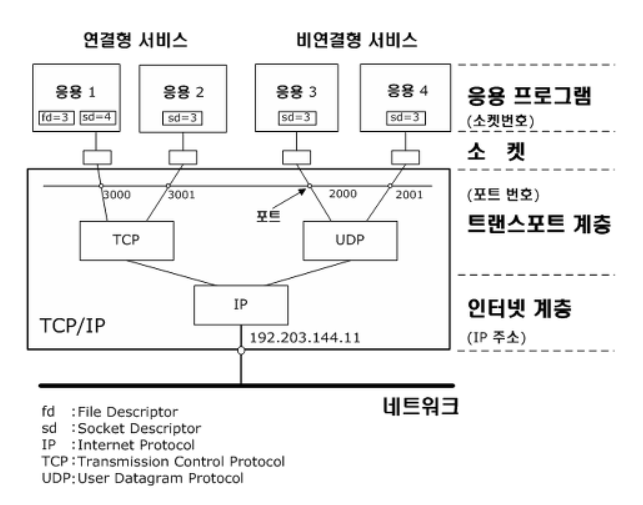

# monitoring.sh

At server startup, the script will display some information (lilsted below) on all terminals every 10 minutes (take a look at `wall`). The banner is optional. No error must be visible.

Your script must always be able to display the following information:

- The architecture of your operating system and its kernel version.
- The number of physical processors.
- The number of vritual processors.
- The current available RAM on your server and its utilization rate as a percentage.
- The current available memory on your server and its utilization rate as a percentage.
- The current utilization rate of your processors as a percentage.
- The date and time of the last reboot.
- Whether LVM is active or not.
- The number of active connections.
- The number of users using the server.
- The IPv4 address of your server and its MAC (Media Access Control) address.
- The nuber of commands executed with the `sudo` program.

i) During the defense, you will be asked to explain how this script works. You will also bave to interrupt it without modifying it. Take a look at cron.

서버가 작동하면, 스크립트는 아래의 정보를 매 10 분마다 터미널에 출력해야 한다(`wall` 옵션을 참고할 것). 배너를 넣는 것은 선택 사항이고, 스크립트에서 오류가 발생해선 안된다.

여러분의 스크립트는 아래의 정보를 언제나 출력해야 한다:

- 여러분이 사용하는 운영 체제와 커널 버전
- 물리 프로세서의 개수
- 가상 프로세서의 개수
- 여러분의 서버의 RAM 사용량을 퍼센티지로 표시
- 여러분의 서버의 메모리 사용량을 퍼센티지로 표시
- 현재 프로세서의 사용량을 퍼센티지로 표시
- 마지막 재부팅 시각
- LVM 활성화 여부
- 현재 활성화된 네트워크 연결의 개수
- 서버를 사용하고 있는 유저의 수
- 여러분의 서버의 IPv4 주소의 MAC 주소
- `sudo`와 함께 실행된 명령어의 개수

i) 여러분이 디펜스를 진행하는 동안, 스크립트가 어떻게 작동하는지 설명할 수 있어야 한다. 또한 스크립트를 수정하지 않고, 진행되는 스크립트를 중단할 수도 있어야 한다. cron을 살펴볼 것.

---

먼저, 스크립트에 표시해야 할 사항들을 하나씩 구현해보자.

## 운영체제와 커널 버전 출력

커널 버전을 출력하는 명령어는 많지만(`hostnamectl`, `cat /proc/version` ...) 서브젝트의 사진과 가장 유사하게 출력하기 위해선 `uname -a`를 사용해야 한다. `-a` 플래그는 `uname`의 모든 옵션(커널 이름, 호스트 이름, 커널 버전, 아키텍처, 프로세서 ...)을 한꺼번에 출력한다.

```sh
echo "#Architecture: $(uname -a)"
```

참고: [https://www.cyberciti.biz/faq/command-to-show-linux-version/](https://www.cyberciti.biz/faq/command-to-show-linux-version/)

## 물리 프로세서의 개수

물리 프로세서 개수를 세기 위해 `lscpu` 명령어를 사용하였다. `Socket(s)`의 항목을 `grep`과 `awk`로 가져온다.

```sh
echo "#CPU physical : $(lscpu | grep 'Socket' | awk '{ print $2 }')"
```

- CPU 소켓은 컴퓨터의 마더 보드를 CPU와 연결하는 장치이다. 따라서 소켓의 개수는 곧 물리 CPU의 개수라고 볼 수 있을 것이라고 생각하였다.
- `nproc` 명령어는 CPU 코어의 개수를 세는 것이기에, 물리 프로세서의 개수와 차이가 날 것이다.


이미지 출처: https://www.intel.com/content/www/us/en/developer/articles/technical/performance-counter-monitor.html

참고: [https://www.cyberciti.biz/faq/check-how-many-cpus-are-there-in-linux-system/](https://www.cyberciti.biz/faq/check-how-many-cpus-are-there-in-linux-system/)

## 가상 프로세서의 개수

`/proc/cpuinfo`의 항목을 출력하여 가상 프로세서(vCPU)의 개수를 출력한다. `/proc/cpuinfo`는 현재 컴퓨터의(즉 가상 머신의) CPU 정보를 표시한다. 0 부터 카운팅되기 때문에, `processor : 0`은 하나의 가상 프로세서가 있다는 의미이다.

```sh
echo "vCPU : $(cat /proc/cpuinfo | grep 'processor' | wc -l)"
```

참고: [https://webhostinggeeks.com/howto/how-to-display-the-number-of-processors-vcpu-on-linux-vps/](https://webhostinggeeks.com/howto/how-to-display-the-number-of-processors-vcpu-on-linux-vps/)

## 서버의 RAM 사용량 표시

```sh
RAM_RATE=$(free -m | grep Total | awk '{ printf("%d/%dMB (%.2f%%)\n", $3, $2, $3/$2 * 100.0) }')
echo "#Memory Usage: $RAM_RATE"
```

- `-m` 플래그는 MB 단위로 사용량을 표시한다.
- 퍼센티지 기호를 `printf`로 출력하기 위해선 두 번 적어야 한다.

질문:

1. `free`로 출력하는 메모리 사용량 중에서, `buff/cache`를 포함하지 않는 이유는?
   - 일반적으로 Memory utilization은 특정한 순간에 사용 가능한 메모리의 사용량을 나타낸다고 한다. `buff/cache`가 메모리의 일정 부분을 점유하고 있지만, 서브젝트가 요구하는 것은 직접 사용할 수 있는(available) 용량을 의미한다고 생각하였기에, `buff/cache`를 포함시키지 않았다.
2. RAM과 메모리의 차이는?
   - 간단하게 RAM은 컴퓨터가 종료되면 데이터가 사라지는 휘발성을 가지고, 그 외의 Memory는 하드디스크와 같이 장기적으로 데이터를 저장할 수 있다.

참고:  
[https://stackoverflow.com/questions/10585978/how-to-get-the-percentage-of-memory-free-with-a-linux-command](https://stackoverflow.com/questions/10585978/how-to-get-the-percentage-of-memory-free-with-a-linux-command)  
[https://devconnected.com/how-to-check-ram-on-linux/](https://devconnected.com/how-to-check-ram-on-linux/)  
[https://beforb.tistory.com/5](https://beforb.tistory.com/5)  
[https://www.easytechjunkie.com/what-is-the-difference-between-ram-and-memory.htm](https://www.easytechjunkie.com/what-is-the-difference-between-ram-and-memory.htm)

## 서버의 메모리 사용량 표시

서브젝트에서 말하는 메모리는 RAM이 아닌 메모리, 즉 하드디스크를 의미한다고 생각하여, `df` 명령어를 사용하였다.

```sh
DISK_USED=$(df -m /home /root | awk '{ sum += $3 } END { printf("%d", sum) }')
DISK_TOTAL=$(df -m /home /root | awk '{ sum += $2 } END { printf("%d", sum / 1024) }')
DISK_RATE=$(awk -v USED="$DISK_USED" -v TOTAL="$DISK_TOTAL" 'BEGIN { printf("(%d%%)\n", USED/TOTAL / 1024 * 100) }')
echo "#Disk Usage: $DISK_USED/${DISK_TOTAL}Gb $DISK_RATE"
```

- root와 home 디렉터리의 디스크 용량을 합쳐서 계산하였다.
- `-m` 플래그는 MB 단위로 사용량을 표시한다.

참고:  
[https://maktooob.tistory.com/19](https://maktooob.tistory.com/19)  
[https://www.unix.com/filesystems-disks-and-memory/40966-sum-df-command.html](https://www.unix.com/filesystems-disks-and-memory/40966-sum-df-command.html)  
[https://www.hostinger.com/tutorials/vps/how-to-check-and-manage-disk-space-via-terminal](https://www.hostinger.com/tutorials/vps/how-to-check-and-manage-disk-space-via-terminal)

## 프로세서의 사용량 표시

서브젝트 사진에는 'CPU Load'로 적혀있는데, CPU 사용률(CPU Usage)과 CPU 부하(CPU Load)는 완전히 같은 의미는 아니라고 한다.

- CPU Load는 CPU에 실행중이거나 대기중인 작업의 개수(즉 프로세스의 개수)를 평균으로 나타낸 값이다.
  - CPU Load는 CPU가 얼마나 잘 사용되고 있는지 확인하는 지표로 사용할 수 있다.
  - CPU Load는 일반적으로 0~1의 값을 갖는다(다만 이는 단일 코어의 경우이고, 코어의 개수에 따라 값은 배가 된다). 만약 1의 값을 넘어가는 경우, CPU에서 처리하지 못하고 대기하는 프로세스가 있다는 의미이다.
  - CPU Load 수치는 낮을 수록 좋다.
  - Linux에서 `uptime` 명령어로 CPU Load를 확인할 수 있다.
- CPU Usage는 시스템 사용률(CPU System)과 사용자 사용률(CPU User) 등을 합친 값이다.
  - 시스템 사용률은 운영체제가 사용한 CPU 사용률을 의미하며, 사용자 사용률은 응용프로그램이 사용하는 CPU 사용률을 의미한다.
  - 시스템 사용률이 높다면 시스템 사양을 높여야 한다.
  - 사용자 사용률이 높다면 시스템 업그레이드 또는 어플리케이션의 분배에 대해 고민해야 한다.

따라서 'CPU Load'의 값을 서브젝트에 나온 대로 utilization의 의미로 해석하여, CPU Usage를 출력하였다.

`cat /proc/stat`로 별 다른 패키지의 설치 없이 확인할 수도 있지만, `/proc/stat`은 시스템이 부팅된 이후, [CPU의 사용률을 누적하여 나타낸 것](https://www.idnt.net/en-US/kb/941772)이기에, 실제 사용률과 다를 수 있다고 생각하였다. 무엇보다, 리눅스는 현재 CPU의 사용률을 "한 번에" 나타낼 수 있는 시스템 요소를 가지지 않는다고 한다!

나는 `top` 명령어를 두 번 실행하여, 첫 번째 `top`의 결과를 제외한 값을 출력하였다(첫 번째 값은 CPU 변화량을 비교할 샘플이 없기 때문에, 대신 마지막 부팅 이후의 평균 CPU Load값을 나타낸다고 한다([https://bugzilla.redhat.com/show_bug.cgi?id=174619](https://bugzilla.redhat.com/show_bug.cgi?id=174619))).

```sh
CPU_USAGE=$(top -d 0.5 -b -n2 | grep -Po "[0-9.]*(?=( id,))" | tail -1 | awk '{ printf("%.1f%%\n", 100-$1) }')
echo "#CPU load: $CPU_USAGE"
```

- `-d` : 실행 반복 딜레이를 설정한다. 여기서는 첫 번째 `top`과 두 번째 `top` 실행을 0.5초 간격으로 설정함.
- `-b` : Batch 모드로 실행. 사실 여기서는 큰 차이는 없지만, 인터랙티브 모드로 실행하였을 땐 모든 프로세스가 표시되지 않는 반면, Batch 모드는 모두 표시한다. 일반적으로 Batch 모드는 해당 결과를 데이터로 사용할 때 자주 쓰이는 듯하다. [https://unix.stackexchange.com/questions/138484/what-does-batch-mode-mean-for-the-top-command](https://unix.stackexchange.com/questions/138484/what-does-batch-mode-mean-for-the-top-command)
- `-n` : `top`을 실행할 횟수 설정. 첫 번째 `top` 결과는 잘못된 값을 가지기에 두 번 실행하여 마지막 값을 취한다(`tail -1`).
- `-Po` : `grep` 명령어에서 사용되는 플래그. `-P`는 `Perl` 언어 방식의 정규 표현식을 사용한다는 의미이고, `-o`는 현재 정규 표현식에 해당하는 부분만 출력한다는 의미이다.
- `[0-9.]*(?=( id,))` : `grep` 명령어와 함께 사용하는 정규 표현식.
  - `[0-9.]*` : 주어진 문자열에서 한 자리 숫자와 점(`.`) 문자를 모두 찾는다(`... 0.0 us, 100.0 id ...`문자열에서 `0.0 100.0`를 매칭한다).
  - `(?=( id,))` : 정규 표현식의 Lookaround 기능 중 하나인 Positive Lookahead. `?=` 이후의 조건이 만족되는 이전의 매칭을 결과에 포함한다(따라서 매칭된 패턴 중 `100.0 id,` 문자열에서 `100.0`만 출력된다).

* 만약 CPU 사용률을 테스트하고 싶다면, `stress`를 사용하자:

```sh
# stress 패키지 설치
apt install stress

# worker를 1로 설정, output이 안나오게 quiet, background 실행
stress -c 1 -q &

# stress 프로세스 모두 중단
pkill stress
```

참고:  
[https://www.baeldung.com/linux/get-cpu-usage](https://www.baeldung.com/linux/get-cpu-usage)  
[https://brunch.co.kr/@leedongins/76](https://brunch.co.kr/@leedongins/76)  
[https://sabarada.tistory.com/146](https://sabarada.tistory.com/146)  
[https://unix.stackexchange.com/questions/69185/getting-cpu-usage-same-every-time](https://unix.stackexchange.com/questions/69185/getting-cpu-usage-same-every-time)
[https://stackoverflow.com/questions/9229333/how-to-get-overall-cpu-usage-e-g-57-on-linux](https://stackoverflow.com/questions/9229333/how-to-get-overall-cpu-usage-e-g-57-on-linux)  
[https://scripter.co/grep-po/](https://scripter.co/grep-po/)  
[https://elvanov.com/2388](https://elvanov.com/2388)

## 마지막 재부팅 시각 표시

Linux의 `who` 명령어는 호스트에 로그인한 사용자의 정보를 출력한다. `-b` 플래그는 마지막 부팅 시간을 출력한다.

```sh
echo "#Last boot: $(who -b | awk '{ printf("%s %s\n", $3, $4) }')"
```

참고: [https://hbase.tistory.com/256](https://hbase.tistory.com/256)

## LVM 활성화 여부

`/etc/fstab` 파일을 확인하여 LVM 사용 여부를 확인한다. `fstab` 파일은 리눅스에서 사용하는 파일시스템 정보를 저장하고 있으며, 리눅스 부팅 시 마운트 정보를 저장하고 있다. 만약 `root`의 파일시스템이 `/dev/mapper/<VM name>`이라면, LVM을 사용하고 있다는 의미가 된다. `dev/mapper`의 의미는, 리눅스 커널의 물리적 공간을 가상 공간으로 한 단계 추상화하여 매핑하였다는 뜻이다([https://en.wikipedia.org/wiki/Device_mapper](https://en.wikipedia.org/wiki/Device_mapper)).

```sh
if [[ $(cat /etc/fstab | grep 'root') =~ "/dev/mapper" ]]; then
	echo "#LVM use: yes"
else
	echo "#LVM use: no"
fi
```

- 정규식을 이용하여 `/dev/mappper`가 대상에 포함되어 있는지 확인한다(포함된다면 1, 아니면 0 반환).
- 스크립트의 대괄호의 개수는 작동에는 차이가 없지만, 괄호가 하나인 경우 별도의 프로세스가 실행(`/usr/bin/[`), 반면 괄호가 두 개인 경우 bash 자체적으로 내장된 기능을 사용하여 별도의 프로세스를 실행하지 않는다. ([http://bahndal.egloos.com/531206](http://bahndal.egloos.com/531206))

참고:  
[https://meongj-devlog.tistory.com/134](https://meongj-devlog.tistory.com/134)  
[https://askubuntu.com/questions/202613/how-do-i-check-whether-i-am-using-lvm](https://askubuntu.com/questions/202613/how-do-i-check-whether-i-am-using-lvm)

## 활성화된 네트워크 연결 개수 표시

`ss` 명령어는 리눅스 시스템의 소켓 상태를 조회할 수 있는 유틸리티이다. `ss`는 옵션 없이 사용하면 listening socket(Clinet측 소켓의 연결 요청이 있을 때까지 기다리는 Server의 소켓. Client 소켓에서 연결 요청을 하고 Server 소켓이 허락을 해야 통신을 할 수 있도록 연결된다.)을 제외하고 현재 연결되어 있는 모든 소켓(TCP/UDP/Unix)을 표시한다. TCP 소켓을 표시하기 위해선 `-t` 옵션을 주면 된다.

- 소켓(Socket)이란? : 프로그램이 네트워크에서 데이터를 통신할 수 있도록 연결해주는 통신 인터페이스. 소켓은 인터넷과 프로세스 사이에 놓여 그 둘을 연결하는 역할을 한다.
- TCP(Transmission Control Protocol) : 서버와 클라이언트 간에 데이터를 신뢰성 있게 전달하기 위해 만들어진 프로토콜. 서버와 클라이언트가 1대 1로 연결되며, 연결형 서비스를 지원하는 프로토콜로 인터넷 환경에서 기본으로 사용한다. IP가 데이터의 배달을 처리한다면 TCP는 패킷을 추적하고 관리한다.
- UDP(User Datagram Protocol) : 연결 상태를 유지하기보단 주어진 목적지로 데이터를 전달만 하는 비연결지향(connectionless) 프로토콜. 커뮤니케이션이 일어나기 전까지 연결이 이루어지지 않는다(즉 커뮤니케이션의 순간에만 연결이 되어있다). - 'fire-and-forgot' 프로토콜.


이미지 출처: https://ghfkdgml.tistory.com/14

연결된 소켓은 `State` 필드가 `ESTAB`으로 표시된다. 따라서 `ESTAB`이 표시된 행의 개수를 세어 출력하였다.

```sh
TCP_CONN=$(ss -t | grep 'ESTAB' | wc -l)
echo "#Connections TCP : $TCP_CONN ESTABLISHED"
```

참고:  
[https://www.lesstif.com/lpt/linux-socket-ss-socket-statistics-91947283.html](https://www.lesstif.com/lpt/linux-socket-ss-socket-statistics-91947283.html)  
[https://medium.com/@su_bak/term-socket%EC%9D%B4%EB%9E%80-7ca7963617ff](https://medium.com/@su_bak/term-socket%EC%9D%B4%EB%9E%80-7ca7963617ff)  
[https://codinghero.tistory.com/98](https://codinghero.tistory.com/98)  
[https://simhyejin.github.io/2016/07/04/connectionoriented-connectionless/](https://simhyejin.github.io/2016/07/04/connectionoriented-connectionless/)  
[https://www.spiceworks.com/tech/networking/articles/tcp-vs-udp/](https://www.spiceworks.com/tech/networking/articles/tcp-vs-udp/)

## 현재 서버를 사용하고 있는 유저의 수 표시

`who` 명령어로 현재 접속한 사용자의 정보의 개수를 세어 표시하자.

```sh
echo "#User log: $(who | wc -l)"
```

## 서버의 IPv4 주소와 MAC 주소 표시

Linux 서버의 IP 주소는 `hostname` 명령어를 통해 확인할 수 있다. IP 주소를 나타내는 옵션으로는 `-i`와 `-I`가 있는데, 실제 서버의 IP 주소를 확인하기 위해선 `-I` 옵션을 사용해야 한다.

왜냐하면 `i` 옵션이 보여주는 IP 주소는 루프백(loopback) 주소이기 때문이다. 루프백 주소는 호스트 자기 자신과 통신하기 위한 주소이기 때문에, 실제로 외부에서 접근하는 IP 주소와는 다르다. 네트워크가 연결되지 않아도 루프백 주소에 접근할 수 있다. 우리가 익숙하게 들은 localhost가 바로 루프백 주소이다.

`-I` 옵션은 루프백 주소와 IPv6 주소를 제외하고, 호스트가 실제로 네트워크에서 여겨지는 주소를 반환한다.

MAC 주소는 `/sys/class/net/enp0s3/address`에서 확인할 수 있다.

- MAC 주소란? : 네트워크 상에서 서로를 구분하기 위해 장치(Device)마다 할당된 물리적 주소를 의미한다. 하드웨어 주소, 물리적 주소, 이더넷(Ethernet) 주소 등으로 불리기도 한다. IP 주소는 네트워크 주소로, 통신 중 변동 가능성이 존재한다. 따라서 안전한 통신을 위해서는 변하지 않는 기계의 고유한 주소 번호가 있어야 하는데, 맥 주소가 이러한 역할을 담당한다. 따라서 두 장치의 통신에는 데이터의 목적지인 IP 주소 뿐만 아니라 맥 주소가 함께 지정되어야 한다.
- `enp0s3` : 이더넷 장치에 할당된 이름(`en`이 이더넷을 의미한다).

```sh
echo "#Network: IP $(hostname -I)($(cat /sys/class/net/enp0s3/address))"
```

참고:  
[https://www.kernel.org/doc/Documentation/ABI/testing/sysfs-class-net](https://www.kernel.org/doc/Documentation/ABI/testing/sysfs-class-net)  
[https://www.howtouselinux.com/post/linux-command-get-mac-address-in-linux](https://www.howtouselinux.com/post/linux-command-get-mac-address-in-linux)  
[https://stackoverflow.com/questions/60615270/hostname-i-vs-hostname-i-in-linux](https://stackoverflow.com/questions/60615270/hostname-i-vs-hostname-i-in-linux)  
[https://askubuntu.com/questions/754213/what-is-difference-between-localhost-address-127-0-0-1-and-127-0-1-1](https://askubuntu.com/questions/754213/what-is-difference-between-localhost-address-127-0-0-1-and-127-0-1-1)  
[https://jhnyang.tistory.com/404](https://jhnyang.tistory.com/404)

## 실행된 sudo 명령어의 개수 표시

`journalctl` 명령어를 사용하여 실행된 sudo 명령어들을 구하였다. `journalctl`은 `systemd`의 서비스 로그를 검색하고 확인할 수 있는 유틸리티이다. 리눅스용 시스템/서비스 매니저인 `systemd` 프로세스는 로그 데이터를 journal이라는 바이너리 형식으로 저장한다.

```sh
echo "#Sudo : $(jorunalctl _COMM=sudo | grep 'COMMAND' | wc -l) cmd"
```

참고:  
[https://www.lesstif.com/system-admin/linux-journalctl-82215080.html](https://www.lesstif.com/system-admin/linux-journalctl-82215080.html)
[https://unix.stackexchange.com/questions/167935/details-about-sudo-commands-executed-by-all-user](https://unix.stackexchange.com/questions/167935/details-about-sudo-commands-executed-by-all-user)

# CRON 설정

이제 마지막으로 주기적으로 10분마다 스크립트가 실행되면 터미널에 결과가 출력되는 과정을 완료하자.

`crontab`은 cron 작업을 설정하는 파일이다. cron은 UNIX 운영체제에서 어떤 작업을 특정 시간에 실행시키기 위한 [데몬(daemon)](https://haruhiism.tistory.com/9)이다. cron 프로세스는 `/etc/crontab` 파일에 설정된 내용을 읽고 작업을 수행한다.

우선, `monitoring.sh`를 `chmod +x`를 이용하여 실행 가능하도록 설정한다.

그리고 `crontab -e`를 입력하여 `crontab`에 아래처럼 쓴다.

```sh
# crontab

*/10 * * * * /root/monitoring.sh | wall
```

- 매 10분마다 스크립트 실행.
- `wall` : 터미널에 접속된 모든 사용자의 터미널로 메세지를 보내는 명령어.

`crontab`을 확인하고 싶다면 `contab- l`을 입력한다.
`crontab`을 중지하고 싶다면 `crontab -r`을 입력하면 된다.

참고:  
[https://jootc.com/p/201811172241](https://jootc.com/p/201811172241)  
[https://jdm.kr/blog/2](https://jdm.kr/blog/2)

맨데토리는 여기서 끝!
