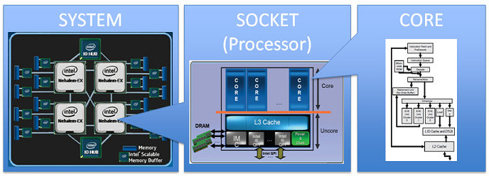

# monitoring.sh

At server startup, the script will display some information (lilsted below) on all terminals every 10 minutes (take a look at `wall`). The banner is optional. No error must be visible.

Your script must always be able to display the following information:
* The architecture of your operating system and its kernel version.
* The number of physical processors.
* The number of vritual processors.
* The current available RAM on your server and its utilization rate as a percentage.
* The current available memory on your server and its utilization rate as a percentage.
* The current utilization rate of your processors as a percentage.
* The date and time of the last reboot.
* Whether LVM is active or not.
* The number of active connections.
* The number of users using the server.
* The IPv4 address of your server and its MAC (Media Access Control) address.
* The nuber of commands executed with the `sudo` program.

i) During the defense, you will be asked to explain how this script works. You will also bave to interrupt it without modifying it. Take a look at cron.

서버가 작동하면, 스크립트는 아래의 정보를 매 10 분마다 터미널에 출력해야 한다(`wall` 옵션을 참고할 것). 배너를 넣는 것은 선택 사항이고, 스크립트에서 오류가 발생해선 안된다.

여러분의 스크립트는 아래의 정보를 언제나 출력해야 한다:
* 여러분이 사용하는 운영 체제와 커널 버전
* 물리 프로세서의 개수
* 가상 프로세서의 개수
* 여러분의 서버에서 사용 가능한 RAM을 퍼센티지로 표시
* 여러분의 서버에서 사용가능한 메모리를 퍼센티지로 표시
* 현재 프로세서의 사용률을 퍼센티지로 표시
* 마지막 재부팅 시각
* LVM 활성화 여부
* 현재 활성화된 네트워크 연결의 개수
* 서버를 사용하고 있는 유저의 수
* 여러분의 서버의 IPv4 주소의 MAC 주소
* `sudo`와 함께 실행된 명령어의 개수

i) 여러분이 디펜스를 진행하는 동안, 스크립트가 어떻게 작동하는지 설명할 수 있어야 한다. 또한 스크립트를 수정하지 않고, 진행되는 스크립트를 중단할 수도 있어야 한다. cron을 살펴볼 것.

* * *

먼저, 스크립트에 표시해야 할 사항들을 하나씩 구현해보자.

## 운영체제와 커널 버전 출력

커널 버전을 출력하는 명령어는 많지만(`hostnamectl`, `cat /proc/version` ...) 서브젝트의 사진과 가장 유사하게 출력하기 위해선 `uname -a`를 사용해야 한다. `-a` 플래그는 `uname`의 모든 옵션(커널 이름, 호스트 이름, 커널 버전, 아키텍처, 프로세서 ...)을 한꺼번에 출력한다.

```sh
echo "#Architecture: $(uname -a)"
```

참고: [https://www.cyberciti.biz/faq/command-to-show-linux-version/](https://www.cyberciti.biz/faq/command-to-show-linux-version/)

## 물리 프로세서의 개수

물리 프로세서 개수를 세기 위해 `lscpu` 명령어를 사용하였다. `Socket(s)`의 항목을 `grep`과 `awk`로 가져온다.

```sh
echo "#CPU physical : $(lscpu | grep 'Socket' | awk '{ print $2 }')"
```
* CPU 소켓은 컴퓨터의 마더 보드를 CPU와 연결하는 장치이다. 따라서 소켓의 개수는 곧 물리 CPU의 개수라고 볼 수 있을 것이라고 생각하였다.
* `nproc` 명령어는 CPU 코어의 개수를 세는 것이기에, 물리 프로세서의 개수와 차이가 날 것이다.


이미지 출처: https://www.intel.com/content/www/us/en/developer/articles/technical/performance-counter-monitor.html

참고: [https://www.cyberciti.biz/faq/check-how-many-cpus-are-there-in-linux-system/](https://www.cyberciti.biz/faq/check-how-many-cpus-are-there-in-linux-system/)

## 가상 프로세서의 개수

`/proc/cpuinfo`의 항목을 출력하여 가상 프로세서(vCPU)의 개수를 출력한다. `/proc/cpuinfo`는 현재 컴퓨터의(즉 가상 머신의) CPU 정보를 표시한다. 0 부터 카운팅되기 때문에, `processor : 0`은 하나의 가상 프로세서가 있다는 의미이다.

참고: [https://webhostinggeeks.com/howto/how-to-display-the-number-of-processors-vcpu-on-linux-vps/](https://webhostinggeeks.com/howto/how-to-display-the-number-of-processors-vcpu-on-linux-vps/)

작성해야함!
