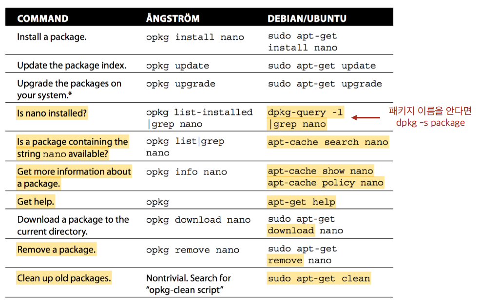

# SSH 포트 및 권한 변경

A SSH service will be running on port 4242 only. For security reasons, it must not be possible to connect using SSH as root.
SSH 연결은 4242번 포트에서만 가능해야 하고, 루트 계정으로 연결되어서는 안된다.

## SSH란?

SSH(Secure Shell, Secure Socket Shell)는 네트워크 프로토콜 중 하나로, 컴퓨터 간 인터넷과 같은 공용 네트워크(Public Network)의 통신에 있어 보안을 보장하여, 서로 안전한 통신을 가능하게 한다. 과거에는 텔넷(TELNET)이라는 네트워크 프로토콜을 이용하여 통신을 하였으나, 텔넷의 보안 문제로 사용률이 감소하여 현재는 SSH가 많이 쓰이고 있다고 한다.
* 프로토콜(Protocol) : 서로 다른 통신 장비 간 주고 받는 데이터의 양식과 규칙. 클라이언트의 브라우저가 웹페이지를 보여주기 위해 서버와 HTTP/HTTPS 프로토콜로 통신을 하는 것처럼, 서로 다른 컴퓨터들이 shell을 통해 통신하기 위해 SSH를 사용한다.

SSH를 이용한 통신에서는 클라이언트(Clinent: Host에 접속하려고 하는 컴퓨터)와 호스트(Host: 접속 대상)의 통신이 암호화되어, 통신으로 전송되는 모든 데이터가 암호화되기에 안전하다. SSH 통신은 기본적으로 TCP 포트 22번을 사용한다. SSH는 키 교환 알고리즘을 사용하여 송/수신자 간 안전한 연결을 구성한다.
* 포트(port) : 네트워크 서비스나 특정 프로세스를 식별하는 논리적 단위를 의미하며, 클라이언트가 특정 서버의 프로그램을 지정하는 방법으로 사용된다. 하나의 호스트 컴퓨터는 여러 개의 서버를 실행할 수 있기에, 클라이언트가 어느 서버에 접속할 것인지 포트 번호를 사용하여 명시한다.

참고:  
[https://medium.com/@jamessoun93/ssh란-무엇인가요-87b58c521d6f](https://medium.com/@jamessoun93/ssh%EB%9E%80-%EB%AC%B4%EC%97%87%EC%9D%B8%EA%B0%80%EC%9A%94-87b58c521d6f)  
[https://whitedelay.github.io/post/what-is-ssh](https://whitedelay.github.io/post/what-is-ssh)  
[https://study-recording.tistory.com/13](https://study-recording.tistory.com/13)  

* * *

과제 말미에 sudo와 관련된 작업을 해야하기에 미리 sudo를 설치한다. 하지만 설치하기 전에, `apt update`, `apt upgrade`로 운영체제를 최신의 상태로 유지하자.

```sh
# sudo가 시스템에 설치되어 있는지 확인하고 싶다면...
dpkg-query -l | grep sudo

# sudo를 설치한다.
apt install sudo

# pretty한 에디팅을 위해 vim도 설치...
apt install vim
```

## dpkg?

dpkg란 데비안 패키지 관리 시스템의 기초가 되는 소프트웨어이다. 패키지 관리(Package Management)란, 새로운 소프트웨어를 설치, 업데이트, 삭제하는 일을 말한다. 패키지는 저장소(repository)에 저장되어 있으며, HTTP 혹은 FTP 서버를 통해 다운로드 할 수 있다. 리눅스는 배포판에 따라 서로 다른 패키지 형식을 지원하는데, 데비안의 계열의 경우, `.deb` 파일 확장자를 가진다.

패키지를 관리하기 위한 패키지 관리 도구는 저수준 툴(low-level tools)과 고수준 툴(high-level tools)로 나뉜다.

* 저수준 툴 : 실제 패키지의 설치, 업데이트 삭제 등을 수행. 하지만 자동으로 패키지를 다운로드하거나 패키지 간 의존성을 해결하지 않는다.
* 고수준 툴 : 패키지 의존성 해결, 패키지 다운로드, 패키지 검색 등의 기능을 제공.

dpkg는 데비안 계열의 리눅스에서 사용되는 저수준 패키지 관리자(low-level package manager)이고, apt는 데비안 계열의 리눅스에서 사용되는 고수준 패키지 관리자(high-level package manager)이다. 소프트웨어를 관리하는데 보통 apt 명령으로 충분하지만, 시스템에 있는 특정 파일과 패키지의 관계를 보는 것처럼, 보다 자세한 일을 수행하기 위해선 dpkg 명령이 필요하다고 한다.



참고: [https://gamsungcoding.tistory.com/entry/Linux-리눅스Linux-패키지-관리하기](https://gamsungcoding.tistory.com/entry/Linux-%EB%A6%AC%EB%88%85%EC%8A%A4Linux-%ED%8C%A8%ED%82%A4%EC%A7%80-%EA%B4%80%EB%A6%AC%ED%95%98%EA%B8%B0)

## sudo를 왜 설치해야 할까?

과제에서 sudo를 다루는 문제가 나오긴 하지만, 우리가 sudo를 사용함으로써 얻을 수 있는 이점은 무엇일까?

sudo(substitute user do)를 사용하면 root가 시스템 상에서 작업하는 시간이 짧아진다. root shell로 장시간 작업을 하다가 실수를 하게 될 경우, 결과를 책임질 수 없게 된다. 따라서 root 권한이 필요한 명령어의 경우에만 sudo를 사용한다면, 사용자의 오류를 방지할 수 있게 된다.

또한 sudo를 사용하면 사용자의 특권 행동이 로그(log)로 남게 되기에 추적이 쉬워지고, 이에 따라 사용자의 권한과 책임이 명확해진다. 만약 root 권한을 여러 사람이 공유한다면(su root), 어떤 작업이 누구에 의해 행해졌는지 파악할 수 없게 된다.

마지막으로 sudo는 sudoers라는 파일에 등록된 사용자만 사용할 수 있기에, 침입자는 sudo를 사용할 수 없다. 만약 침입자가 sudo를 사용하기 위해 자신의 존재를 sudoers에 등록한다면, 침입자의 정보가 시스템에 모두 기록되므로 침입자의 정보를 알 수 있게 된다.

따라서 root 권한을 최소화하는 것이 시스템 보안에 중요한 요소라면, sudo의 사용은 보안의 기본이라고 할 수 있을 것이다. 하지만 동시에 sudo 명령어를 남용하는 것을 조심해야 할 것이다. 가령 root가 아닌 유저가 sudo 명령어로 패키지를 설치하게 된다면 시스템 보안의 문제가 발생할 수 있다.

* 참고로 sudo와 su는 조금 다르다! su는 사용자를 전환하는 명령어라면(`su -`는 root 계정으로 전환된다), sudo는 사용자 전환 없이 단일 명령에 대해 root 권한을 부여한다.

참고: [https://deois.tistory.com/entry/sudo사용의-필요성](https://deois.tistory.com/entry/sudo%EC%82%AC%EC%9A%A9%EC%9D%98-%ED%95%84%EC%9A%94%EC%84%B1)

* * *

아래의 과정을 따라 SSH 서버를 설치한다.

```sh
# devian 11에서는 이미 깔려 있었다.
sudo apt install openssh-server

# SSH 서버가 작동하고 있는지 확인. 작동한다면 Active 항목이 active (running)으로 표시된다.
systemctl status ssh
```
* systemctl이란?
	- systemctl은 systemd 및 서비스를 제어하고 관리하는 데 사용되는 Linux 유틸리티이다. systemd(system management daemon)는 시스템의 첫 번째 프로세스(1번 PID)로, 부팅부터 서비스 관리, 로그 관리 등 시스템의 전반적인 기능을 관리하는 데몬(daemon, 백그라운드에서 여러 작업을 하는 프로세스)이다. `ctl` 접미사는 control을 의미한다고 XD
	- 참고: [https://junb51.tistory.com/9](https://junb51.tistory.com/9)

SSH는 기본적으로 22번 포트로 연결되어 있기에, sshd_config 파일을 수정하여 포트를 변경하고 루트 계정 접속을 막는다.

```sh
# /etc/ssh/sshd_config

...
# 주석 처리되어 있는 Port를 해제하고, 22를 4242로 변경한다.
Port 4242
...
# 주석 처리되어 있는 PermitRootLogin을 해제하고, no로 변경한다.
PermitRootLogin no
```

변경을 완료하고, SSH 서버를 재시작한다.

```sh
sudo systemctl restart ssh
```

## 호스트 컴퓨터와 가상 머신 연결하기

호스트 컴퓨터에서 SSH로 접속하기 위해, 가상 머신의 IP 주소를 확인한다. `10.0.2.15`는 Virtual Box 내부용 IP이다. 그리고 SSH가 4242번 포트를 사용하는지 다시 한 번 확인하자!

```sh
hostname -I

# output
10.0.2.15

systemctl status ssh

# output
...
Jul 23 14:39:39 gychoi42 sshd[509]: Server listening on 0.0.0.0 port 4242.
```

하지만, `10.0.2.15`는 Virtual Box의 private network에서 작동하는 사설 IP(private IP)이기에, 호스트 컴퓨터는 해당 IP 주소로 접근할 수 없다. 따라서 호스트 컴퓨터가 가상 머신의 네트워크로 SSH 접속을 할 수 있도록 NAT를 이용한 포트포워딩을 해주자. (SSH 접속을 위한 포트 포워딩을 SSH Tunneling이라고 부르기도 한다. 즉, Local과 Remote 컴퓨터 간 터널을 뚫는다.)
* NAT란? : NAT(Network Address Translation)는 라우터 등의 장비를 통해 다수의 사설 IP를 하나의 공인 IP(public IP)로 변환하는 기술이다. NAT을 사용하면 호스트 컴퓨터의 IP 주소를 사용하여 가상 머신 네트워크의 자원을 이용할 수 있다.
	- 참고: [https://velog.io/@zigje9/NAT란](https://velog.io/@zigje9/NAT%EB%9E%80)
* 포트포워딩이란? : 포트 포워딩(Port-Forwarding)은 패킷이 라우터와 같은 네트워크 게이트웨이를 통과하는 동안, 네트워크 주소를 변환하는 것이다. 즉, 외부 IP의 특정 포트에 전송된 요청을 라우터가 내부 IP의 특정 포트를 향하도록 연결한다. 사설 IP의 단점은 IP를 알아볼 수 없기 때문에, 요청을 보내고 싶어도 보낼 수 없다는 것이다. 따라서 공인 IP와 사설 IP를 포트포워딩하여, 공인 IP로 요청이 들어오면 사설 IP로 향하도록 설정한다.
	- 참고: [https://technerd.tistory.com/36](https://technerd.tistory.com/36)

1. 먼저, Virtual Box 창을 열고 톱니바퀴 모양 'Settings'를 누른다.
2. Network 탭으로 들어가 NAT로 설정이 되어있는지 확인하고, Advanced를 펼친다.
3. Advanced 아래에 있는 'Port Forwarding' 버튼을 누르고, 우측 상단 초록색 버튼을 눌러 규칙을 추가한다.
4. 아래와 같이 규칙을 설정한다.
```
Name             Protocol     Host IP     Host Port     Guest IP     Guest Port
Rule 1           TCP          127.0.0.1   4242          10.0.2.15    4242
```
* 127.0.0.1은 호스트 컴퓨터의 IP를 나타내는 loopback 주소이다.
5. OK를 누르고 설정을 저장한다.

이제 `ssh gychoi@127.0.0.1 -p 4242`를 입력하면, 가상 머신으로 연결된다. NAT로 호스트 컴퓨터의 주소가 가상 머신의 주소를 향하도록 지시하였고, 포트포워딩으로 호스트 컴퓨터의 4242번 포트를 가상 머신의 4242번 포트로 연결하였다.

참고:  
[https://velog.io/@combi_jihoon/네트워크10-NAT와-포트포워딩](https://velog.io/@combi_jihoon/%EB%84%A4%ED%8A%B8%EC%9B%8C%ED%81%AC10-NAT%EC%99%80-%ED%8F%AC%ED%8A%B8%ED%8F%AC%EC%9B%8C%EB%94%A9)  
[https://www.nemonein.xyz/2020/01/3048/](https://www.nemonein.xyz/2020/01/3048/)

# UFW 방화벽 설정

You have to configure your operating system with the UFW firewall and thus leave only port 4242 open. Your firewall must be active when you launch your virtual machine.
UFW 방화벽으로 운영 체제를 설정하고, 4242 포트만 열어놓는다. 가상 머신을 실행할 때 방화벽도 같이 활성화해야 한다.

## 방화벽이란?

방화벽(firewall)은 외부 사용자(WAN, Wide Area Network)들이 내부 네트워크(LAN, Local Area Network)에 불법으로 접근하지 못하도록 하는 네트워크 보안 시스템이다. 방화벽은 신뢰할 수 있는 내부 네트워크와 신뢰할 수 없는 외부 네트워크 간의 장벽을 구성하여,  미리 정의된 보안 규칙에 기반하여 들어오고 나가는 네트워크 트래픽을 모니터링하고 제어한다. 

방화벽의 주요 기능은 다음과 같다:
* 접근 제어 : 외부에서 내부 네트워크에 접속하는 패킷을 필터링하거나 프록시 방식을 이용하여 접근을 통제한다.
* 사용자 인증 : 방화벽을 지나가는 트래픽에 대한 사용자를 증명한다.
* 감사 및 로그 : 트래픽에 대한 접속 정보를 기록하고, 네트워크 사용에 대한 통계를 제공한다.
* 프라이버시 보호 : 프록시, 이중 DNS 등의 기능을 제공하여 내부 네트워크와 외부 네트워크 간의 중개자 역할을 함으로써 내부 네트워크의 정보 유출을 방지한다.
* 데이터 암호화 : 보통 VPN의 기능을 이용하여 방화벽에서 다른 방화벽까지 데이터를 암호화하여 전송한다.
* 주소 변환 : 발신지 호스트의 IP 주소나 목적지 호스트의 IP 주소를 전송 단계에서 변경하여 전달한다.

참고:  
[https://m.blog.naver.com/scw0531/221479042618](https://m.blog.naver.com/scw0531/221479042618)  
[https://co-no.tistory.com/26](https://co-no.tistory.com/26)

## UFW란?

UFW(Uncomplicated Firewall)는 데비안 계열 및 다양한 리눅스 환경에서 작동되는 사용하기 쉬운 방화벽 관리 프로그램이다. UFW는 기본적으로 8.04 LTS(Long Term Support) 이후의 모든 데비안 및 우분투에서 사용할 수 있다([https://ko.wikipedia.org/wiki/UFW](https://ko.wikipedia.org/wiki/UFW))...라곤 하지만, Devian 11에는 설치되어 있지 않으니, 아래의 과정을 따라 설치하자.

```sh
# UFW 설치
sudo apt install ufw

# 설치한 후, UFW를 활성화해야 한다.
sudo ufw enable

# UFW 비활성화
sudo ufw disable

# UFW 상태 확인(간단하게)
sudo ufw status

# UFW 상태 확인(자세하게)
sudo ufw status verbose
```

## UFW 규칙 설정

방화벽에서 4242포트만 열어놓기 위해, 우선 기본 정책으로 모든 접근을 차단한다. 그리고 tcp/udp 상관 없이, 4242번 포트를 연다.

```sh
# 듣기로는 기본적으로 내부 네트워크에 들어오는 모든 접근을 차단(deny)한다고 하지만,
# 유비무환의 정신으로 다시 한 번 설정하자.
sudo ufw default deny

# 4242번 포트를 연다.
sudo ufw allow 4242

# 업데이트된 상태를 확인한다.
sudo ufw status verbose

# output:
...
Default: deny (incoming), allow (outgoing), disabled (routed)
...
To                      Action        from
--                      ------        ----
4242                    ALLOW IN      Anywhere
4242 (v6)               ALLOW IN      Anywhere (v6)
```

UFW와 관련된 몇 가지 참고할 만한 설정들

* 방화벽 정책 삭제
```sh
# 내가 만든 정책을 숫자로 확인한 후, 삭제할 수 있다.
sudo ufw status numbered

# output:
status: active

     To                      Action        from
     --                      ------        ----
[ 1] 4242                    ALLOW IN      Anywhere
[ 2] 4242 (v6)               ALLOW IN      Anywhere (v6)

sudo ufw delete 1

# output:
Deleting:
  <내가 만든 규칙>
Proceed with operation (y|n)?
```

* 방화벽 로그 기록
```sh
# 로그 기록 실행
sudo ufw logging on
# 로그 기록 중지
sudo ufw logging off
```

`sudo ufw enable`로 방화벽을 활성화하면, 방화벽은 가상 머신이 실행되면 자동으로 실행된다.

참고: [https://webdir.tistory.com/206](https://webdir.tistory.com/206)

# Hostname 확인

The hostname of your virtual machine must be your login ending with 42 (e.g., wil42). You will have to modify this hostname during your evaluation.
가상 머신의 호스트 이름은 여러분의 로그인 아이디 + 42 입니다. 여러분은 평가 도중 호스트 이름으 변경해야 합니다.

## hostname?
호스트 이름(hostname)은 호스트 컴퓨터가 네트워크에서 불리는 이름이다. 호스트 이름은 지역 네트워크에서 컴퓨터 간 서로를 구분하기 위해 사용된다.

## hostname 확인 및 변경

```sh
# 먼저 혹시 모르니 systemd가 설치되어 있는지 확인하자.
dpkg-query -l | grep systemd

# 잘 설치되어 있다면... (설치 안되었으면 apt로 다운로드!)
hostnamectl

# output:
    Static hostname: gychoi42
    ...

# 호스트 이름 변경
hostnamectl set-hostname <new-hostname>
```

참고: [https://www.hostinger.com/tutorials/linux-change-hostname](https://www.hostinger.com/tutorials/linux-change-hostname)

길이가 길어져서 2편으로 분할한다!

[Part 2-2. Setting: 패스워드, sudo](./setting2.md)
