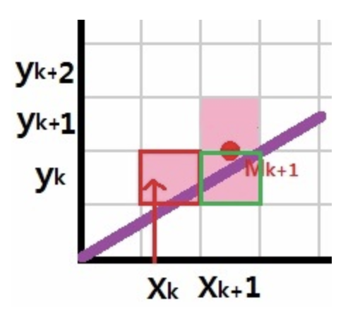

# fdf


## Some Algorithms

### Bresenham Algorithm

실수 연산이 필요 없이 정수 연산 만으로 처리되는, 속도가 매우 빠른 래스터 방식 직선 그리기 알고리즘. (by 네이버 지식백과)

우리가 생각하는 좌표계와 다르게 컴퓨터 스크린은 픽셀 단위로 이루어져 있기에, 수학적인 직선을 표현하기 위해 적절한 픽셀의 선택이 필요하다.


브레젠험(Bresenham) 알고리즘은 시작점에서 종료점까지 1 픽셀씩 증가하는 x 좌표의 다음 y 좌표에 대해, 기준점을 바탕으로 y 좌표도 1 픽셀 증가시킬 것인지, 그대로 유지할 것인지 결정한다.

중요한 점은, x 좌표는 1 픽셀 증가한 값을 그대로 사용하지만, y 좌표는 [y 좌표, y + 1 좌표]를 결정해야 하는 상황이기 때문에, 그 사이의 값인 **중단점**(m), 즉, y 좌표와 y + 1 좌표 사이의 값을 사용해야 한다.

0에서 1로 변하는 픽셀의 상태값에 대해, 중단점은 그 사이의 값인 0.5로 삼을 수 있을 것이다. 왜냐하면 0.5는 반올림의 기준이 되기 때문이다. 0 ~ 0.499... 까지의 상태값은 0으로, 0.5 ~ 0.999... 까지의 상태값은 1로 삼는다. 이러한 중단점을 가정하여 사용하는 이유는, 정수 계산을 위한 편의로 볼 수 있을 것 같다.

즉, 중단점의 좌표는 다음처럼 나타낼 수 있다 : `(x_k, y_k + 0.5)`

따라서, 다음 x 좌표에 대해, 만약 직선이 중단점보다 위에 존재하면 y의 좌표를 1 픽셀 증가시키고, 그렇지 않다면 y 좌표를 그대로 유지하게 된다.

```
if (중단점 <= 직선)
	y 좌표 그대로
else if (중단점 > 직선)
	y 좌표 + 1
```
<br />


그렇다면, 중단점과 직선의 관계를 판단할 수 있는 판별식을 구하여 코드로 구현해야 한다.

1. 먼저, 직선의 방정식을 구하기 위해, 직선의 기울기를 구한다.
	- 기울기 : `(x_2 - x_1) / (y_2 - y_1)` (두 점 (x_1, y_1), (x_2, y_2)라고 가정)
	- 이제, W = `(x_2 - x_1)` , H = `(y_2 - y_1)`라고 정의한다.
2. 직선의 방정식을 만든다.
	- `y = H/W * x + b`
3. x와 y에 한 점(x_1, y_1))을 넣어서, b를 계산한다.
	- `b = y_1 - H/W * x_1`
4. 2번에서 만들었던 직선의 방정식에, b를 대입한다.
	- `y = H/W * x + y_1 - H/W * x_1`
5. 이제 수학적인 직선을 구하였으니, 이 직선을 바탕으로 y 좌표와 직선의 관계를 확인할 수 있다.
	- 만약 y 값이 위 방정식보다 크다면, y 좌표가 직선보다 위에 있다는 뜻이다.
	- 만약 y 값이 위 방정식보다 작다면, y 좌표가 직선보다 아래에 있다는 뜻이다.
6. 간단한 판별식으로 만들기 위해, 몇 가지의 과정을 더 거친다.
	1. y를 우변으로 넘긴다 : `-y + H/W * x + y_1 - H/W * x_1 = 0`
	2. 해당 식에서 분모를 없애기 위해, W를 곱한다 : `-Wy + Hx + Wy_1 - Hx_1 = 0`
	3. **중단점을 대입하여 비교**할 것이기에, 2를 곱한다 : `-2Wy + 2Hx + 2Wy_1 - 2Hx_1 = 0`
	4. 식을 간단히 정리한다 : `-2W(y - y_1) + 2H(x - x_1) = 0`
7. 이제, 위 식을 판별식으로 삼아, 중단점과 직선의 관계를 판단할 수 있다.
	- 만약 중단점을 대입한 값이 0보다 작다면, 직선은 중단점보다 아래에 있다는 뜻이다.
		- 따라서 다음 y 좌표의 픽셀을, 같은 y 좌표의 위치에 찍는다.
	- 만약 중단점을 대입한 값이 0보다 크다면, 직선은 중단점보다 위에 있다는 뜻이다.
		- 따라서 다음 y 좌표의 픽셀을, 1 픽셀 위에 찍는다.

위에서 구한 판별식과 중단점의 관계를 고려하여, 다음 픽셀을 어디에 찍을지 확인해보자.

```
// 판별식
F(m) = -2W(y - y_1) + 2H(x - x_1);
if (F(m) < 0)
	중단점(m)이 직선보다 위에 있음;
else if (F(m) > 0)
	중단점(m)이 직선보다 아래에 있음;
```
<br />

현재 좌표 (x_k, y_k)에 픽셀이 찍혀 있고, 다음 좌표 (x_k + 1, y_k + 1)의 중단점 m_k + 1에 대해, 직선은 중단점보다 아래 혹은 위에 그어질 수 있다.



만약, 중단점보다 아래에 직선이 그어졌을 경우, 다음과 같은 판별식을 도출할 수 있다.
- `F(m_k + 1) = -2W(y_k + 0.5 - y_1) + 2H(x_k + 1 - x_1)`


그런데, 현재 중단점과 그 다음 중단점의 관계는 어떻게 될까?

만약, 현재 중단점이 0보다 작은 경우(`F(m_k + 1) < 0`), 다음 중단점도 동일하다.
- 즉, `m_k + 2 = (x_k + 2, y_k + 0.5)`
- 판별식은 다음과 같다 : `F(m_k + 2) = -2W(y_k + 0.5 - y_1) + 2H(x_k + 2 - x_1)`
- 정리해보면, 이전 판별식보다 `2H`만큼 증가하였다.


만약, 현재 중단점이 0보다 큰 경우(`F(m_k + 1) > 0)`), 다음 중단점은 1 픽셀 증가한다.
- 즉, `m_k + 2 = (x_k + 2, y_k + 1.5)`
- 판별식은 다음과 같다 : `F(m_k + 2) = -2W(y_k + 1.5 - y_1) + 2H(x_k + 2 - x_1)`
- 정리해보면, 이전 판별식보다 `2(H-W)`만큼 증가하였다.

판별식의 초기값을 구하기 위해, k에 1을 넣어 계산해보자.
- `m_1 = (x_1 + 1 y_1 + 0.5)`
- `F(m_1) = -2W(y_1 + 0.5 - y_1) + 2H(x_1 + 1 - x_1)`
- `F(m_1) = 2H - W`

이제, 초기값에서 시작하는 판별식의 상태를 바탕으로, 다음의 판별식을 지속적으로 갱신할 수 있게 되었다.
- 만약 초기값 판별식이 0보다 작다면, 이전 판별식에 `2H`를 더한다.
- 만약 초기값 판별식이 0보다 크다면, 이전 판별식에 `2(H-W)`를 더한다.

중요한 점은, 위 경우는 기울기가 1 이하인 경우, 즉 x 축의 변화량이 더 큰 경우에만 적용된다.

기울기가 1 이상인 경우, y 축의 변화량이 더 커지게 되는데, 결과적으로 위의 수식에서 x와 y의 작동 방향이 반대로 된다고 생각할 수 있기에, 판별식의 관계가 정 반대로 된다.
- 판별식의 초기값은 `2W - H`
- 이전 판별식이 0보다 작다면, 이전 판별식에 `2W`를 더한다.
- 이전 판별식이 0보다 크다면, 이전 판별식에 `2(W - H)`를 더한다.

참고 자료:
- [https://playground10.tistory.com/62](https://playground10.tistory.com/62)
- [https://m.blog.naver.com/PostView.naver?isHttpsRedirect=true&blogId=ndb796&logNo=221115220322](https://m.blog.naver.com/PostView.naver?isHttpsRedirect=true&blogId=ndb796&logNo=221115220322)

### Rotation Matrix

회전변환행렬(Rotation Matrix)은 임의의 행렬을 원점으로 중심에서 회전시키는 선형 변환의 성질 중 하나이다.

3차원 회전변환으로 나가기에 앞서, 2차원 회전변환부터 살펴보자.


회전변환 행렬을 쉽게 구하기 위해, 반지름이 1인 원을 가정하고, 점 P는 원 위의 한 점으로 가정한다.
X축 위의 점 P는 (1,0)의 좌표값을 가진다. 이제 (1,0) 좌표를 예각 alpha만큼 변환하였을 때, 삼각함수의 공식에 따라 다음과 같이 좌표값이 구해진다.
- `x = 1 * cos(alpha)`
- `y = 1 * sin(alpha)`

X축의 변환행렬을 구하였으니, Y축의 변환에 대해서도 위와 비슷한 작업을 수행한다.
Y축 위의 점 P는 (0,1)의 좌표값을 가진다. 이제 (0,1) 좌표를 예각 beta만큼 변환하였을 때, 삼각함수의 공식에 따라 다음과 같이 좌표값이 구해진다.
사진은 theta만큼 변환한 경우를 가정하지만, 이해의 편의를 위해 Y축 위의 (0,1)에 대해, 이전과 같이 beta만큼 변환한 경우로 가정하였다.
다만 주의할 점으로, 이전에는 X축을 기준으로 (1,0)에 대해 사인과 코사인을 구하였지만, 이번에는 Y축을 기준으로 (0,1)에 대해 사인과 코사인을 구하는 점을 고려해야 한다.
- `y = 1 * cos(beta)`
- `x = 1 * -sin(beta)`
- 사인 값이 음수인 이유는, 사인의 분모가 음수 X축에 해당되기 때문.

따라서, 위의 변환 정보를 행렬곱으로 나타내면, 아래와 같다.

```
| cos(a) -sin(a) | | x |   | x' |
| sin(a)  cos(a) | | y | = | y' |
```

위의 변환행렬로 X축(1,0)과 Y축(0,1) 위의 임의의 점(x,y)을 a만큼 변환한 좌표(x',y')값을 구할 수 있다.

3차원 회전변환에 위 2차원 회전변환을 사용할 수 있다. 왜냐하면 3개의 직교 축(X, Y, Z) 중 하나를 기준으로 좌표를 변환하면, 결국 2차원 회전변환과 동일한 좌표의 변환이 발생하기 때문이다.
쉽게 말하면, 이전 2차원 회전변환을 Z축에서 수직으로 바라보고 있었던 경우라고 생각할 수 있다.


그렇다면, 2차원 회전행렬을 다음과 같이 Z축에서 수직으로 바라본 경우로 생각할 수 있다.

```
| cos(a) -sin(a) 0 | | x |
| sin(a)  cos(a) 0 | | y |
|   0       0    1 | | z |
```

X축과 Y축에 Z축의 정보가 영향을 끼치지 않고, 그대로 유지된다.


