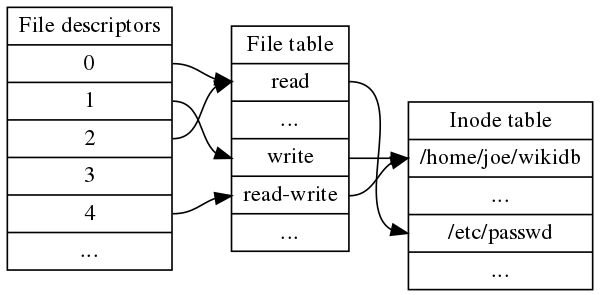
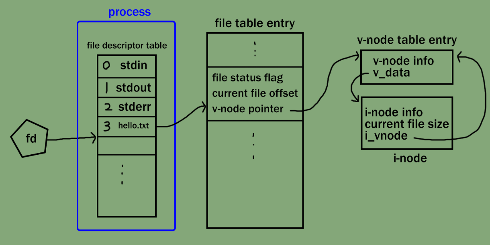
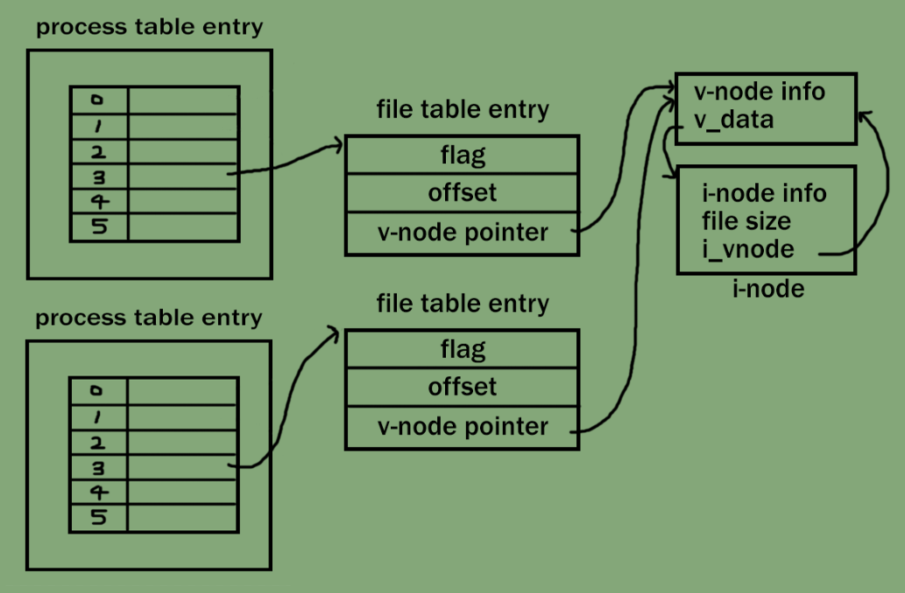
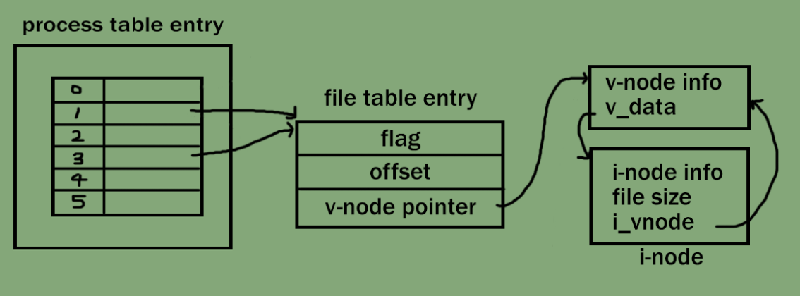
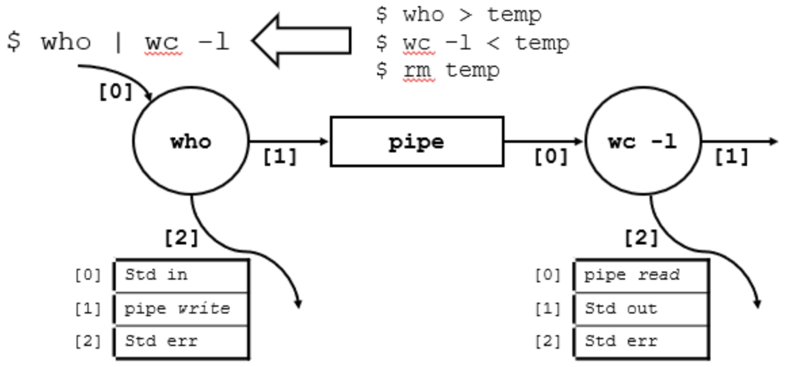
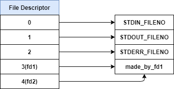
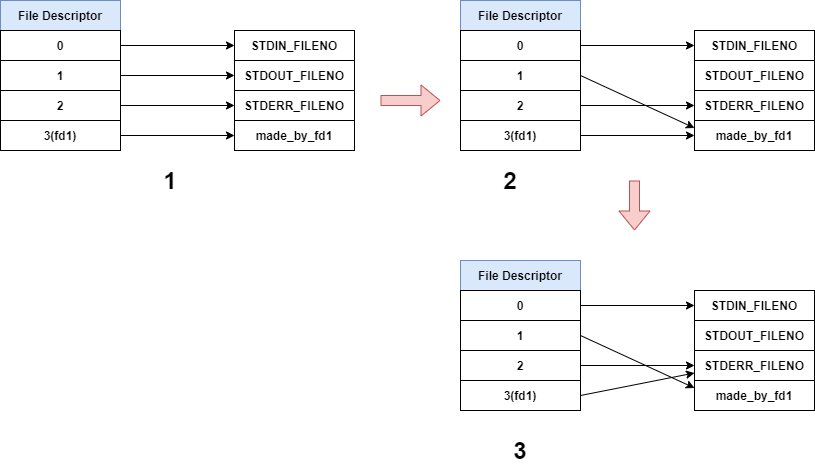

# pipex

UNIX의 파이프 기능을 구현하는 과제이다.

## Some Concepts

### IPC

Inter Process Communication의 약자로, 프로세스 간 데이터를 주고 받는 방식을 의미한다. 운영체제에서 제공하는 주요 IPC 방식으로 파일 시스템, 시그널, 소켓, 메세지 큐, 파이프, 공유 메모리 ... 등이 있다.

### 파일(FILE)

파일은 UNIX에서 사용하는 입출력 방식이자 데이터를 저장하는 형식이다. UNIX는 모든 정보와 장치를 파일로 조작하기 때문에, UNIX 시스템 내의 자원도 파일로서 접근할 수 있다.

### 파일 디스크립터(FD, File Descriptor)

UNIX에서 파일 또는 입출력 장치에 접근하는데 사용하는 식별자(identifier). 일반적으로 양의 정수값을 가지며, 0번은 표준 입력, 1번은 표준 출력, 2번은 표준 에러에 할당되어 있다. 

각 프로세스는 파일 디스크립터 테이블을 가지며, 이를 바탕으로 사용중인 파일을 관리한다.

UNIX는 사용자가 파일을 열거나 소켓을 생성하는 경우, 파일 디스크립터 테이블을 탐색하여, 사용하지 않는 FD의 가장 작은 값을 할당한다. 사용자는 해당 FD에 시스템 콜을 사용함으로써 해당 파일에 접근할 수 있다.
- 사용자는 시스템 콜을 사용하지 않고서는 파일에 접근할 수 없다.

### 파일 테이블(File Table)

파일 디스크립터 테이블이 프로세스 내부에서 파일을 관리하는 데 사용된다면, 파일 테이블은 시스템에서 파일을 관리하는데 사용된다. 파일 디스크립터 테이블과 유사하게, 프로세스가 `open()`과 같은 시스템 콜을 사용하여 파일을 열 때마다 항목이 하나씩 할당되고, `close()` 시스템 콜을 사용하면 항목을 해제한다.

### 아이노드(i-node)

UNIX에서 파일 시스템을 관리하기 위해 사용되는 자료구조. 파일의 속성을 가리키며, 모든 파일은 각자 1개의 아이노드를 가지고 있다. 하나의 파일은 데이터 영역과 아이노드 영역으로 구분된다. 프로세스는 파일의 아이노드 정보를 공유한다. 파일의 아이노드를 모아놓은 아이노드 테이블이 존재한다.

### 프로세스의 파일 접근



여러 개의 파일 디스크립터가 동일한 파일 테이블 엔트리를 가리킬 수 있고, 여러 개의 파일 테이블 엔트리가 동일한 아이노드를 가리킬 수 있다. 그림에서 3번 파일 디스크립터는 close 되었기에, 아무것도 가리키지 않는다.

1) 하나의 프로세스가 하나의 파일을 열었을 경우



2) 서로 다른 프로세스가 동일한 하나의 파일을 열었을 경우



프로세스마다 파일을 읽고 쓰는 위치가 다르므로, 파일 테이블 엔트리의 offset은 서로 다르지만, 아이노드 테이블 엔트리는 같다.

3) 하나의 프로세스가 하나의 파일에 대해 두 개의 파일 디스크립터를 가지는 경우



`dup()` 시스템 콜은 위와 같이 파일 디스크립터를 복사한다. 가령 `P > A`와 같이, 프로그램 P의 결과값을 FD 1번 표준 출력에서 리다이렉션(redirection) 하여 프로그램 A에 출력을 하도록 설정하는 것처럼, `A = dup(1)`을 사용하면 FD 1번이 가리키는 파일을 (사용되지 않은 가장 낮은 값인) FD 3번도 같이 가리키게 되어, 프로그램 A에 P의 표준 출력을 리다이렉션 할 수 있다. (뒤에서 좀 더 자세하게 후술할 예정.)

### 파이프(PIPE)

프로세스 간 통신을 위한 메모리 공간(버퍼)를 생성하여, 프로세스간 데이터 송수신을 처리한다.

과제에서는 부모-자식 프로세스 간 통신을 위한 **익명 파이프(Anonymous PIPE)**를 사용한다. 익명 파이프는 한쪽 방향으로만 통신이 가능하기에, 반이중(Half-Duplex) 통신의 특성을 가진다.

몇 가지 쉘 표현들 :
- `|` : 이전 명령어의 실행 결과를 다음 명령어로 전달한다.
- `&&` : 이전 명령어가 정상적으로 실행되었을 경우에만 결과를 다음 명령어로 전달한다.
- `<` : 저장소에 위치한 파일의 내용을 쉘에 연결한다.
- `>` : 프로그램의 실행 결과를 저장소의 파일에 저장한다.
- `>>` : 위 명령어와 다르게 저장소의 파일의 내용을 지우지 않고, 프로그램의 실행 결과를 저장소의 파일에 덧붙인다.
= `<<` : here document, 이 형식 이후의 입력은 모두 저장이 되다가, 표현과 함께 쓴 단어가 나오는 경우 지금까지 저장된 모든 입력들이 출력된다.

### `pipe()`



```c
#include <unistd.h>

int	pipe(int fd[2]);
```

`pipe()` 사용 시, 배열로 두 개의 파일 디스크립터를 할당받는다. `fd[0]`은 input stream, `fd[1]`은 output stream으로 
작동한다. 부모 프로세스가 `fd[1]`에 write 한 데이터를, 자식 프로세스가 `fd[0]`으로 read 할 수 있다.

```
기억하자, 1에 쓰고 0으로 읽는다!
```

주의할 점으로, **각 프로세스에서 사용하지 않는 FD는 닫아야 한다**. write end가 닫히면, 이후 read는 EOF를 나타내는 0을 반환한다. read end가 닫히면, 이후 write는 SIGPIPE를 발생시킨다. 만약 write end가 닫히지 않는다면, read는 write가 EOF를 줄 때까지 계속 기다리게 된다. 반대로 read end가 닫히지 않는다면, write는 read가 write를 완료하기 위한 공간을 만들어 줄 때까지 계속 기다리게 된다(혹은 문제가 생기지 않는 것처럼 보이지만, read pipe가 닫힌 이후, write를 하는 일은 오류임에도, read end가 열려있다면 이를 오류로 처리할 수 없다).

### `dup(), dup2()`

`dup()`과 `dup2()`는 파일 디스크립터를 복제한다.

```c
#include <unistd.h>

int	dup(int fd);
```
`dup()`은 전달받은 파일 디스크립터를 복제한다. 성공 시 새로운 파일 디스크립터를, 오류 시 -1을 반환한다.

예제 코드:
```c
#include <unistd.h>
#include <fcntl.h>
#include <stdio.h>

int	main(void)
{
	int	int fd1, fd2;
	char	message[6] = "Hello\n";

	fd1 = open("made_by_fd1", O_RDWR|O_CREAT);
	if (fd1 < 0)
	{
		close(fd1);
		return (1);
	}
	fd2 = dup(fd1);
	write(fd2, message, 6);
	printf("fd1: %d, fd2: %d\n", fd1, fd2);
	close(fd1);
	close(fd2);
	return (0);
}
```

```
// output
> gcc main.c
> ./a.out
fd1: 3, fd2: 4
> cat made_by_fd1
Hello
```


```c
#include <unistd.h>

int	dup2(int fd, int fd2);
```
`dup2()`는 복제된 파일 디스크립터를 fd2로 지정한다. 만약 fd2가 이미 할당되어 있다면, 해당 파일 디스크립터를 닫은 후, 전달받은 파일 디스크립터를 복제하여 할당한다. 성공 시 새로운 파일 디스크립터를, 오류 시 -1을 반환한다.

예제 코드:
```c
#include <unistd.h>
#include <fcntl.h>
#include <stdio.h>

int	main(void)
{
	int	fd1, ret;
	char	message[7] = "STDERR\n";

	// 1
	fd1 = open("made_by_fd1", O_RDWR|O_CREAT);
	if (fd1 < 0)
	{
		close(fd1);
		return (1);
	}
	printf("THIS SHOULD PRINT OUT\n");
	// 2
	ret = dup2(fd1, STDOUT_FILENO);
	printf("fd1: %d, ret: %d\n", 1, ret);
	// 3
	ret = dup2(STDERR_FILENO, fd1);
	write(fd1, message, 7);
	printf("THIS SHOULDN'T PRINT OUT\n");
	close(fd1);
	close(ret);
	return (0);
}
```

```
// output
> gcc main.c
> ./a.out
THIS SHOULD PRINT OUT
STDERR
> cat made_by_fd1
fd1: 3, ret: 1
THIS SHOULD'T PRINT OUT
```


1. fd1이 3번 FD를 가진 상태로, 파일을 연다.
2. `dup2()`로 1번 FD(표준 출력 FD)가 표준 출력이 아닌 파일을 가리키도록 변경한다. ret의 값은 1을 가진다.
	- `printf()`는 표준 출력, 즉 FD 1번으로 출력을 하는데, 방금 `dup2()`로 FD 1이 표준 출력이 아닌 파일을 가리키도록 변경하였기 때문에, 터미널이 아닌 파일로 출력이 된다.
3. `dup2()`로 fd1이 파일이 아닌 표준 에러를 가리키도록 한다. 따라서 fd1에 메세지를 출력하면 파일이 아닌 터미널에 표준 에러로 작성된다.

### `fork()`

```c
#include <unistd.h>

pid_t	fork(void);
```


### `wait()`, `waitpid()`

```c
#include <sys/wait.h>

pid_t	wait(int *status);
```
`wait()` 시스템 콜은 자식 프로세스가 종료될 때까지 부모 프로세스를 `sleep()` 모드로 대기시킨다. 만약 자식 프로세스가 종료되었다면, 함수는 즉시 리턴하여 자식이 사용한 모든 시스템 자원을 해제한다.

이로써 부모 프로세스보다 자식 프로세스가 먼저 종료되어, *고아 프로세스*(PPID 1)가 생기는 것을 방지한다. 하지만 어떤 이유로 부모가 `wait()`를 호출하기 전에, 자식 프로세스가 종료되는 경우가 발생할 수 있는데, 이 경우 자식 프로세스는 *좀비 프로세스*가 된다. 이 경우, `wait()` 함수는 즉시 리턴하도록 되어있다.

`wait()`의 인자 status를 통해 자식 프로세스의 종료 상태를 받아올 수 있다. 시스템 콜 성공 시 종료된 자식 프로세스의 PID를 반환하고, 실패할 경우 -1을 반환한다.

```c
#include <sys/wait.h>

pid_t	waitpid(pid_t pid, int *status, int options);
```
`waitpid()` 시스템 콜은 `wait()`처럼 자식 프로세스가 종료될 때까지 부모 프로세스를 대기시키지만, `wait()`은 자식 프로세스 중 어느 하나라도 종료되면 부모 프로세스로 바로 복귀하지만, `waitpid()`는 특정 자식 프로세스가 종료될 때까지 대기한다.

또한 `wait()`는 자식 프로세스가 종료될 때까지 block되지만, `waitpid()`에 WHOHANG 옵션을 사용하면 부모 프로세스가 block 상태가 되지 않고 작업을 병행할 수 있다.

일반적으로 pid에는 특정한 자식 프로세스의 PID가 들어가고, status에는 자식 프로세스의 종료 상태를 담는다. options에는 부모 프로세스의 대기 상태를 설정한다. 시스템 콜 성공 시 종료된 자식 프로세스의 PID를 반환하고, 실패 시 -1을 반환한다. WHOHANG을 사용하였는데 자식 프로세스가 종료되지 않았다면 0을 반환한다.

```
pid
-1 : 여러 자식 중 하나라도 종료되면 부모 프로세스로 복귀한다. wait()와 동일한 처리.
 0 : 현재 프로세스 그룹 ID와 같은 그룹의 자식 프로세스가 종료되면 복귀한다.
양수 : pid에 해당하는 자식 프로세스가 종료되면 복귀한다.

options
WHOHANG : 자식 프로세스가 종료되었는지, 실행 중인지 확인하고, 바로 부모 프로세스로 복귀한다. 부모 프로세스가 block되지 않는다.
   0    : 자식 프로세스가 종료될 때까지 부모 프로세스가 block된다. wait()와 동일한 처리.
```

참고 자료:
1. IPC:
	- [https://ko.wikipedia.org/wiki/%ED%94%84%EB%A1%9C%EC%84%B8%EC%8A%A4_%EA%B0%84_%ED%86%B5%EC%8B%A0](https://ko.wikipedia.org/wiki/%ED%94%84%EB%A1%9C%EC%84%B8%EC%8A%A4_%EA%B0%84_%ED%86%B5%EC%8B%A0)
	- [https://dar0m.tistory.com/233](https://dar0m.tistory.com/233)
2. 파일 처리: [https://ddongwon.tistory.com/16](https://ddongwon.tistory.com/16)
3. 파일 디스크립터 : [https://en.wikipedia.org/wiki/File_descriptor](https://en.wikipedia.org/wiki/File_descriptor)
4. 파이프:
	- [https://hyeonski.tistory.com/8](https://hyeonski.tistory.com/8)
	- [https://sosal.kr/83](https://sosal.kr/83)
	- [https://m.blog.naver.com/nywoo19/221708412078](https://m.blog.naver.com/nywoo19/221708412078)
	- [https://stackoverflow.com/questions/11599462/what-happens-if-a-child-process-wont-close-the-pipe-from-writing-while-reading](https://stackoverflow.com/questions/11599462/what-happens-if-a-child-process-wont-close-the-pipe-from-writing-while-reading)
5. `dup()`, `dup2()`:
	- [https://en.wikipedia.org/wiki/Dup_(system_call)](https://en.wikipedia.org/wiki/Dup_(system_call))
	- [https://reakwon.tistory.com/104](https://reakwon.tistory.com/104)
6. `fork()`:
7. `wait()`, `waitpid()`:
	- [https://reakwon.tistory.com/45](https://reakwon.tistory.com/45)
	- [https://www.joinc.co.kr/w/man/2/wait](https://www.joinc.co.kr/w/man/2/wait)
	- [https://badayak.com/entry/C%EC%96%B8%EC%96%B4-%EC%9E%90%EC%8B%9D-%ED%94%84%EB%A1%9C%EC%84%B8%EC%8A%A4-%EC%A2%85%EB%A3%8C-%ED%99%95%EC%9D%B8-%ED%95%A8%EC%88%98-waitpid](https://badayak.com/entry/C%EC%96%B8%EC%96%B4-%EC%9E%90%EC%8B%9D-%ED%94%84%EB%A1%9C%EC%84%B8%EC%8A%A4-%EC%A2%85%EB%A3%8C-%ED%99%95%EC%9D%B8-%ED%95%A8%EC%88%98-waitpid)
